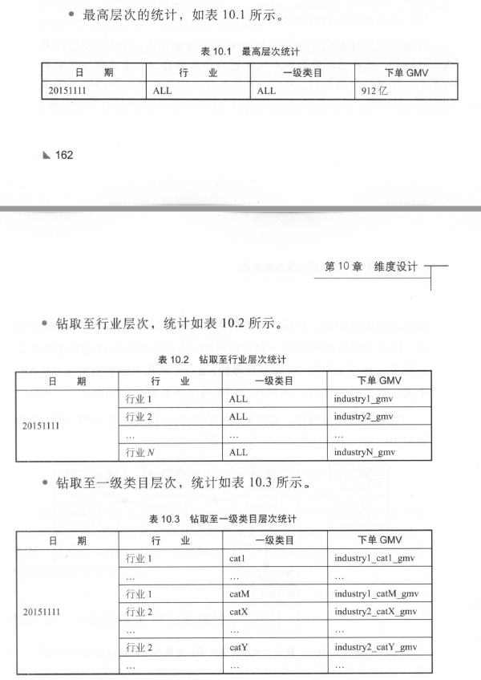
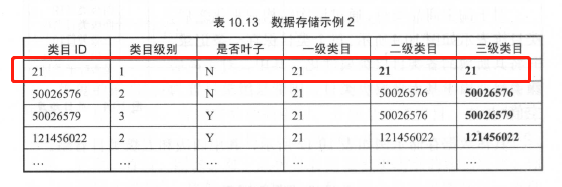

# 数据模型

### 大数据就能获得以下好处：

性能：好的数据模型能加速查询

成本：减少数据冗余，较好复用

效率：改善用户体验

质量：数据口径统一

### olap特点

关注数据整合，批量读写，复杂大批量聚合查询

## 建模方法

### er模型

### 维度模型

#### 设计过程

确定业务过程

选择粒度

识别维表：分组和筛选

选择事实：衡量指标

#### 星形

#### 雪花

### data vault模型

### anchor模型

# 数据整合和管理

可管理、可追溯、可规避重复建设

架构体系

数据规范命名体系

规范定义

### 名词术语

数据域：一个个不可拆分的行为事件，长期维护更新，不能轻易变动，扩展性好

业务过程：活动中的事件

时间周期

修饰类型：修饰词的划分

修饰词：

度量/原子指标：不可再拆分的指标

维度：反映业务属性

派生指标：原子指标+修饰词（可选）+时间周期

### 指标体系

派生指标

事务型指标、存量型指标只会定位到一个业务过程。

原子指标：动作+度量

时间周期修饰词

事务型指标： 是指对业务活动进行衡量的指标。如新发商品数、订单支付金额

存量型指标：是指对实体对象（如商品、会员）某些状态的统计。例如商品总数

复合型指标：是在事务型指标和存量型指标的基础上复合而成的。例如浏览UV－下单买家数转化率

* 比率型： 创建原子指标，如C TR 、浏览UV－ 下单买家数转化率、满意率等
* 比例型： 创建原子指标，如百分比、占比
* 变化量型：不创建原子指标，增加修饰词，在此基础上创建派生指标。例如，“最近l 天订单支付金额上l 天变化量”，原子指标为“订单支付金额”，时间周期为“最近1 天”，修饰类型为“统计方法”，修饰词为“上l 天变化量”。
* 变化率型：创建原子指标。例如，“最近7 天海外买家支付金额上7 天变化率”，原子指标为“支付金额变化率”，修饰类型为“ 买家地域”，修饰词为“海外买家”。
* 统计型（均值、分位数等）：不创建原子指标，增加修饰词，在此基础上创建派生指标；在修饰类型“统计方法”下增加修饰词，如人均、日均、行业平均、商品平均、90 分位数、70 分位数等。
* 排名型

## 层次模型

### 

CDM 层又细分为DWD 层和DWS 层，分别是明细数据层和汇总数据层，采用维度模型方法作为理论基础， 更多地采用一些维度退化手法，将维度退化至事实表中，减少事实表和维表的关联，提高明细数据表的易用性：同时在汇总数据层， 加强指标的维度退化， 采取更多的宽表化手段构建公共指标数据层，提升公共指标的复用性，减少重复加工。

* 组合相关和相似数据
* 公共指标统一加工：基于OneData 体系构建命名规范、口径一致和算法统一的统计指标
* 建立一致性维度：建立一致的数据分析维表，降低数据计算口径、算法不统一的风险。

数据调用服务优先使用公共维度模型层（ CDM ）数据，当公共层没有数据时，需评估是否需要创建公共层数据，当不需要建设公用的公共层时，方可直接使用操作数据层（ ODS ）数据。应用数据层（ ADS)作为产品特有的个性化数据一般不对外提供数据服务，但是ADS 作为被服务方也需要遵守这个约定。

### 基本原则

高内聚和低辑合：将业务相近或者相关、粒度相同的数据设计为一个逻辑或者物理模型：将高概率同时访问的数据放一起，将低概率同时访问的数据分开存储。

核心模型与扩展模型分离：核心模型包括的宇段支持常用的核心业务，扩展模型包括的字段支持个性化或少量应用的需要

公共处理逻辑下沉及单一：

成本与性能平衡：适当的数据冗余可换取查询和刷新性能，不宜过度冗余与数据复制。

数据可回滚：处理逻辑不变，在不同时间多次运行数据结果确定不变。

一致性：具有相同含义的字段在不同表中的命名必须相同，必须使用规范定义中的名称。

命名清晰、可理解

## 模型实施

高层模型：对业务过程中的维表和事实表的图形描述

详细模型：确定每个维表的属性和每个事实表的度量，并确定信息来源的位置、定义，确定
属性和度量如何填人模型的初步业务规则。

模型审查、再设计和验证：

提交ETL 设计和开发

### 数据域划分

在进行充分的业务调研和需求调研后，就要构建总线矩阵了。需要做两件事情：明确每个数据域下有哪些业务过程；业务过程与哪些维度相关，并定义每个数据域下的业务过程和维度。

# 维度建模

在维度建模中，将度量称为“事实” ，将环境描述为“维度”，维度是用于分析事实所需要的多样环境。例如，
在分析交易过程时，可以通过买家、卖家、商品和时间等维度描述交易发生的环境。

维度使用主键标识其唯一性，主键也是确保与之相连的任何事实表之间存在引用完整性的基础。主键有两种：代理键和自然键，它们都是用于标识某维度的具体值。但代理键是不具有业务含义的键， 一般用于处理缓慢变化维；自然键是具有业务含义的键。比如商品，在ETL 过程中，对于商品维表的每一行，可以生成一个唯一的代理键与之对应；商品本身的自然键可能是商品ID 等。其实对于前台应用系统来说，商品ID 是代理键：而对于数据仓库系统来说，商品ID 则属于自然键。

选择维度或新建维度。作为维度建模的核心

确定主维表。此处的主维表一般是ODS 表，直接与业务系统同步

确定相关维表。数据仓库是业务源系统的数据整合，不同业务系统或者同一业务系统中的表之间存在关联性。

尽可能生成丰富的维度属性

尽可能多地给出包括一些富有意义的文字性描述

区分数值型属性和事实：如果通常用于查询约束条件或分组统计，则是作为维度属性；如果通常
用于参与度量的计算， 则是作为事实

尽量沉淀出通用的维度属性

### 维度结构层次

在属性的层次结构中进行钻取是数据钻取的方法之一。

当属性层次被实例化为一系列维度，而不是单一的维度时，被称为雪花模式。（通过主键连接属性）

将维度的属性层次合并到单个维度中的操作称为反规范化。分析系统的主要目的是用于数据分析和统计，如何更方便用户进行统计分析决定了分析系统的优劣。采用雪花模式，用户在统计分析的过程中需要大量的关联操作，使用复杂度高，同时查询性能很差；而采用反规范化处理，则方便、易用且性能好。

采用雪花模式，除了可以节约一部分存储外，对于OLAP 系统来说没有其他效用。而现阶段存储的成本非常低。出于易用性和性能的考虑，维表一般是很不规范化的。在实际应用中，几乎总是使用维表的空间来换取简明性和查询性能。

### 一致性维度

数据仓库总线架构的重要基石之一就是一致性维度。在针对不同数据域进行迭代构建或并行构建时，存在很多需求是对于不同数据域的业务过程或者同一数据域的不同业务过程合并在一起观察。比如对于日志数据域，统计了商品维度的最近一天的PV 和UV ； 对于交易数据域，统计了商品维度的最近一天的下单GMV 。现在将不同数据域的商品的事实合并在一起进行数据探查，如计算转化率等，称为交叉探查。

共享维表。

一致性上卷，其中一个维度的维度属性是另一个维度的维度属性的子集，且两个维度的公共维度属性结构和内容相同。

交叉属性，两个维度具有部分相同的维度属性。

### 数据整合

命名规范的统一。表名、字段名等统一。

字段类型的统一。相同和相似字段的字段类型统一。

公共代码及代码值的统一。公共代码及标志性宇段的数据类型、命名方式等统一。

业务含义相同的表的统一。

整合

第一种是垂直整合，即不同的来源表包含相同的数据集，只是存储的信息不同。比如淘宝会员在源系统中有多个表，如会员基础信息表、会员扩展信息表、淘宝会员等级信息表、天猫会员等级信息表，这些表都属于会员相关信息表。

拆分

一是在“水平拆分”中提到的，由于维度分类的不同而存在特殊的维度属性，可以通过水平拆分的方式解决此问题。

二是某些维度属性的来源表产出时间较早，而某些维度属性的来源表产出时间较晚；或者某些维度属性的热度高、使用频繁，而某些维度属性的热度低、较少使用； 或者某些维度属性经常变化，而某些维度属性比较稳定

### 归档

在数据仓库中，可以借用前台数据库的归档策略， 定期将历史数据归档至历史维表。在实践中，网里巴巴数据仓库设计了商品维表和历史商品维表，每天将历史数据归档至历史商品维表。

同前台归档策略，但采用数据库变更日志的方式。对于如此庞大的数据量，阿里巴巴采用的数据抽取策略一般是通过数据库bin log 日志解析获取每日增量，通过增量m erge 全量的方式获取最新的全量数据。可以使用增量日志的删除标志， 作为前台数据归档的标志。

### 维度变化

数据仓库的重要特点之一是反映历史变化，所以如何处理维度的变化是维度设计的重要工作之一。

#### 缓慢变化的维度

重写维度值

插人新的维度行。采用此种方式，保留历史数据，维度值变化前的事实和过去的维度值关联。

快照维表

处理缓慢变化维的方法是采用快照方式。数据仓库的计算周期一般是每天一次，基于此周期，处理维度变化的方式就是每天保留一份全量快照数据。比如商品维度，每天保留一份全量商品快照数据。任意一天的事实均可以获取到当天的商品信息，也可以获取到最新的商品信息，通过限定日期，采用自然键进行关联即可。此方法既有优点，也有弊端。

拉链法

这种处理方式是通过新增两个时间戳字段(start_dt 和end_dt ），将所有以天为粒度的变更数据都记录下来。通常
分区字段也是时间戳字段。

这种存储方式用start_dt 和end_dt 做分区，随着时间的推移，分区数量会极度膨胀，而现行的数据库系统都有分区数量限制。

生效日期和失效日期作为分区字段，带来查询效率优势的同时也引入了一些问题：

- 分区数过多
  如果按照一年来算极限的情况下会有 365*365/2=66612.5个分区,这会给NameNode带来压力
- 查询时需要扫描的分区会比较多
- 数据量一定的情况下会引起过多小文件问题

##### 对拉链表的优化

底层的数据还是历史拉链存储，但是上层做一个视图操作或者在Hive 里做一个hook ，通过分析语句的语法树，把对极限存储前的表的查询转换成对极限存储表的查询。对于下游用户来说，极限存储表和全量存储方式是一样的。

https://zhuanlan.zhihu.com/p/75070697

在做极限存储前有一个全量存储表，全量存储表仅保留最近一段时间的全量分区数据

对于部分变化频率频繁的宇段需要过滤。例如，用户表中存在用户积分宇段，这种宇段的值每天都在发生变化。

微型维度的创建是通过将一部分不稳定的属性从主维度中移出，并将它们放置到拥有自己代理键的新表中来实现的。这些属性相互之间没有直接关联，不存在自然键。通过为每个组合创建新行的一次性过程来加载数据。比如淘宝用户维度，用户的注册日期、年龄、性别、身份信息等基本不会发生变化，但用户VI P 等级、用户信用评价等级会随着用户的行为不断发生变化。

缺点：

破坏了维度的可浏览性。买家维度和微型维度通过事实表建立联系，无法基于VIP 等级、信用等级进行浏览和统计。

ETL 逻辑复杂。生成代理键和使用代理键进行，ETL 加工都非常复杂， ETL 开发和维护成本过高。

降低递归层次使用复杂度的最简单和有效的方=法是层次结构的扁平化

其中粗体部分为回填内容，解决子类目为空的情况

现在的扁平化设计完全可以满足需求，而不需要引人复杂的桥接表。很多时候，简单、直接的技术方案却是最好的解决方案。

### 特殊维度

#### 行为维度

事实相关，如交易、物流等，称之为“行为维度”，或“事实衍生的维度”。

对于行为维度，有两种处理方式，其中一种是将其冗余至现有的维表中，如将卖家信用等级冗余至卖家维表中z 另一种是加工成单独的行为维表，如卖家主营类目。

#### 多值维度

对于多值维度， 一种情况是事实表的一条记录在某维表中有多条记录与之对应。

#### 多值属性

每个商品均有一到多个SKU 、一到多个属性和一到多个标签，所以商品和SKU 、属性、标签都是多对多的关系。

维度主键发生变化， 一个维度值存放多条记录。比如商品SKU 维表，对于每个商品，有多少SKU ，就有多少记录，主键是商品的ID 和SKU 的ID 。此种处理方式扩展性好，使用方便，但需要考虑数据的急剧膨胀情况。比如淘宝商品属性表采用了此种处理方式，数据记录达到几百亿的级别。

#### 杂项维度

杂项维度是由操作型系统中的指示符或者标志宇段组合而成的，一般不在一致性维度之列。比如淘宝交易订单的交易类型宇段，包括话费充值、司法拍卖、航旅等类型：支付状态、物流状态等，它们在源系统中直接保存在交易表中。

一个事实表中可能会存在多个类似的字段，如果作为事实存放在事实表中，则会导致事实表占用空间过大z 如果单独建立维表，外键关联到事实表，则会出现维度过多的情况；如果将这些字段删除，则会有人不同意。

这时，通常的解决方案就是建立杂项维度，将这些字段建立到一个维表中，在事实表中只需保存一个外键即可。

# 事实表设计

原则：

尽可能包含所有与业务过程相关的事实

只选择与业务过程相关的事实

分解不可加性事实为可加的组件

在选择维度和事实之前必须先声明粒度

在同一个事实表中不能有多种不同粒度的事实

事实的单位要保持一致

对事实的null 值要处理：用0填充

使用退化维度提高事实表的易用性

方法：

选择业务过程及确定事实表类型

声明粒度：应该尽量选择最细级别的原子粒度

确定维度

确定事实：事实可以通过回答“过程的度量是什么”来确定

冗余维度

## 事务事实表

### 单事务事实表

即针对每个业务过程设计一个事实表。

### 多事务事实表

将不同的事实放到同一个事实表中，即同一个事实表包含不同的业务过程

将不同业务过程的事实使用不同事实字段进行存放的设计模式：

如果不是当前业务过程的度量，则采取零值处理方式。比如在下单业务过程中，对于支付度量和成功完结度量全部置为0 ，其他业务过程类似处理。

同一个事实表中包含了多个业务过程，在表中如何进行标记呢？淘宝交易事务事实表采取了这样的解决方案，即针对每个业务过程打一个标签，标记当天是否是这个业务过程，比如针对下单，则打一个是否当天下单的标签；针对支付，打一个是否当天支付的标签z 针对成功完结，打一个是否当天成功完结的标签，标签之间互不相干。

## 周期快照事实表

当然，快照周期不一定都按天来进行，也可以按照月或者季度来统计。比如淘宝交易有针对卖家加类目的每月汇总事实表，每月统计一次，同时维度也不仅一个，包含了卖家和类目。

快照事实表和事务事实表的一个关键区别在密度上。事务事实表是稀疏的，只有当天发生的业务过程，事实表才会记录该业务过程的事实，如下单、支付等；而**快照事实表是稠密的，无论当天是否有业务过程发生，都会记录一行，比如针对卖家的历史至今的下单和支付金额**，无论当天卖家是否有下单支付事实，都会给该卖家记录一行。稠密性是快照事实表的重要特征，如果在每个快照周期内不记录行，比如和事务事实表一样，那么确定状态将变得非常困难。

半可加性：比如淘宝交易卖家快照事实表，无法对每天的历史至今的下单金额进行汇总，也没有汇总意义。虽然不能汇总，但可以计算一些平均值，比如计算每天一个下单的平均值。

单维度的每天快照事实表

混合维度的每天快照事实表

全量快照事实表

## 累积快照事实表

累积快照事实表解决的最重要的问题是统计不同业务过程之间的时间间隔，建议将每个过程的时间间隔作为
事实放在事实表中。

对于累积快照事实表，则只有一条记录，针对此记录不断更新。

累积快照事实表适用于具有较明确起止时间的短生命周期的实体，比如交易订单、物流订单等

对于累积快照事实表，还有一个重要作用是保存全量数据。对于淘宝交易，需要保留历史截至当前的所有交易数据，其中一种方式是在ODS 层保留和源系统结构完全相同的数据z 但由于使用时需要关联维度，较为麻烦，所以在公共明细层需要保留一份全量数据，淘宝交易累积快照事实表就承担了这样的作用一一存放加工后的事实，并将各维度常用属性和订单杂项维度退化到此表中。通常用于数据探查、统计分析、数据挖掘等。

事务事实表记录的事务层面的事实，用于跟踪业务过程的行为

周期快照事实表以具有规律性的、可预见的时间间隔来记录事实，如余额、库存、层级、温度等，时间间隔为每

天、每月、每年等，典型的例子如库存日快照表等。

累积快照事实表被用来跟踪实体的一系列业务过程的进展情况，它通常具有多个日期字段，用于研究业务过程中的里程碑过程的时间间隔。另外，它还会有一个用于指示最后更新日期的附加日期宇段。由于事实表中许多日期在首次加载时是不知道的，而且这类事实表在数据加载完成后，可以对其数据进行更新，来补充业务状态变更时的日期信息和事实。

### 无事实的事实表

虽然没有明确的事实，但可以用来支持业务过程的度量。浏览点击

### 聚集型事实表

聚集会带来查询性能的提升，但聚集也会增加ETL 维护的难度。当子类目对应的一级类目发生变更时，先前存在的、已经被汇总到聚集表中的数据需要被重新调整。

