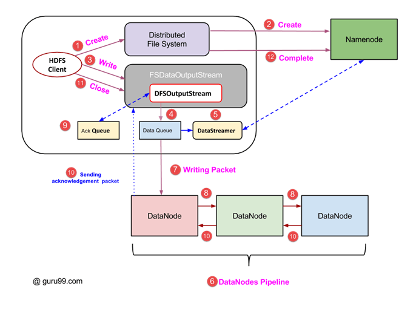
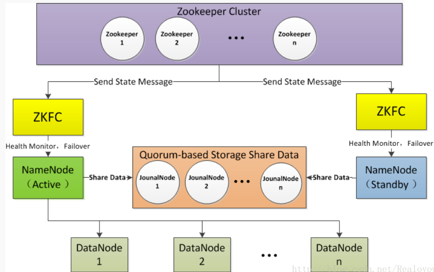
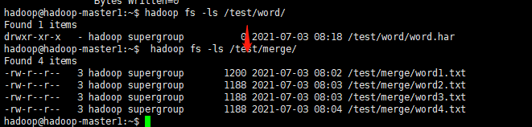
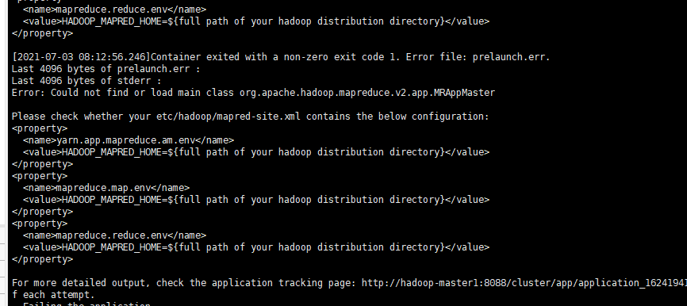

# hadoop组件

HADOOP集群具体来说包含两个集群：HDFS集群和YARN集群，两者逻辑上分离，但物理上常在一起

HDFS集群：

负责海量数据的存储，集群中的角色主要有 NameNode / DataNode

YARN集群：

负责海量数据运算时的资源调度，集群中的角色主要有 ResourceManager /NodeManager

启动

初始化HDFS

bin/hadoop  namenode  -format

启动HDFS

sbin/start-dfs.sh

启动YARN

sbin/start-yarn.sh


# hadoop进程

 1）NameNode：它是hadoop中的主服务器，管理文件系统名称空间和对集群中存储的文件的访问，保存有metadate。**元信息的存储位置由dfs.name.dir指定**。
2）SecondaryNameNode：它不是namenode的冗余守护进程，而是提供周期检查点和清理任务。帮助NN合并editslog，减少NN启动时间。
3）DataNode：它负责管理连接到节点的存储（一个集群中可以有多个节点）。每个存储数据的节点运行一个datanode守护进程。
4）ResourceManager（JobTracker）：JobTracker负责调度DataNode上的工作。每个DataNode有一个TaskTracker，它们执行实际工作。
5）NodeManager：（TaskTracker）执行任务。
6）DFSZKFailoverController：高可用时它负责监控NN的状态，并及时的把状态信息写入ZK。它通过一个独立线程周期性的调用NN上的一个特定接口来获取NN的健康状态。FC也有选择谁作为Active NN的权利，因为最多只有两个节点，目前选择策略还比较简单（先到先得，轮换）。
7）JournalNode：高可用情况下存放namenode的editlog文件。


# hdfs 工作机制

- HDFS集群分为两大角色：NameNode、DataNode  (Secondary Namenode)
- NameNode负责管理整个文件系统的元数据。任何对文件系统名字空间或属性的修改都将被Namenode记录下来。应用程序可以设置HDFS保存的文件的副本数目。文件副本的数目称为文件的副本系数，这个信息也是由Namenode保存的。
- DataNode 负责管理用户的文件数据块
- 文件会按照固定的大小（blocksize）切成若干块后分布式存储在若干台datanode上
- 每一个文件块可以有多个副本（默认3），并存放在不同的datanode上
- Secondary NameNode:从元数据节点。从元数据节点并不是NameNode出现问题时候的备用节点，它的主要功能是周期性的将NameNode中的namespace image和edit log合并，以防log文件过大。此外，合并过后的namespace image文件也会在Secondary NameNode上保存一份，以防NameNode失败的时候，可以恢复。
- **edit log：**修改日志，当文件系统客户端client进行写操作的时候，我们就要把这条记录放在修改日志中。在记录了修改日志后，NameNode则修改内存中的数据结构。每次写操作成功之前，edit log都会同步到文件系统中。
- fsimage：命名空间镜像，它是内存中的元数据在硬盘上的checkpoint。当NameNode失败的时候，最新的checkpoint的元数据信息就会从fsimage加载到内存中，然后注意重新执行修改日志中的操作。而Secondary NameNode就是用来帮助元数据节点将内存中的元数据信息checkpoint到硬盘上的。
- Datanode会定期向Namenode汇报自身所保存的文件block信息，而namenode则会负责保持文件的副本数量
- HDFS的内部工作机制对客户端保持透明，客户端请求访问HDFS都是通过向namenode申请来进行


# HDFS中文件读写操作流程

## read


从图3可以看出，HDFS中的读数据流程可以分为4个步骤，具体如下：

（1） 客户端向NameNode发起RPC请求，来获取请求文件Block数据块所在的位置。

（2） NameNode检测元数据文件，会视情况返回Block块信息或者全部Block块信息，对于每个Block块，NameNode都会返回含有该Block副本的DataNode地址。

（3） 客户端会选取排序靠前的DataNode来依次读取Block块（如果客户端本身就是DataNode，那么将从本地直接获取数据），每一个Block都会进行CheckSum（完整性验证），若文件不完整，则客户端会继续向NameNode获取下一批的Block列表，直到验证读取出来文件是完整的，则Block读取完毕。

（4） 客户端会把最终读取出来所有的Block块合并成一个完整的最终文件（例如：1.txt）。

小提示：

NameNode返回的DataNode地址，会按照集群拓扑结构得出DataNode与客户端的距离，然后进行排序。排序有两个规则：网络拓扑结构中距离客户端近的则靠前；心跳机制中超时汇报的DataNode状态为无效的，则排靠后。

## write



HDFS中的写数据流程可以分为12个步骤，具体如下：

（1） 客户端发起文件上传请求，通过RPC（远程过程调用）与NameNode建立通讯。

（2） NameNode检查元数据文件的系统目录树。

（3） 若系统目录树的父目录不存在该文件相关信息，返回客户端可以上传文件。

（4） 客户端请求上传第一个Block数据块，以及数据块副本的数量（可以自定义副本数量，也可以使用集群规划的副本数量）。

（5） NameNode检测元数据文件中DataNode信息池，找到可用的数据节点（DataNode_01，DataNode_02，DataNode_03）。

（6） 将可用的数据节点的IP地址返回给客户端。

（7） 客户端请求3台节点中的一台服务器DataNode_01，进行传送数据（本质上是一个RPC调用，建立管道Pipeline），DataNode_01收到请求会继续调用服务器DataNode_02，然后服务器DataNode_02调用服务器DataNode_03。

（8） DataNode之间建立Pipeline后，逐个返回建立完毕信息。

（9） 客户端与DataNode建立数据传输流，开始发送数据包（数据是以数据包形式进行发送）。

（10） 客户端向DataNode_01上传第一个Block数据块，是以Packet为单位（默认64K），发送数据块。当DataNode_01收到一个Packet就会传给DataNode_02，DataNode_02传给DataNode_03； DataNode_01每传送一个Packet都会放入一个应答队列等待应答。

（11） 数据被分割成一个个Packet数据包在Pipeline上依次传输，而在Pipeline反方向上，将逐个发送Ack（命令正确应答），最终由Pipeline中第一个DataNode节点DataNode_01将Pipeline的 Ack信息发送给客户端。

（12） DataNode返回给客户端，第一个Block块传输完成。客户端则会再次请求NameNode上传第二个Block块和第三块到服务器上，重复上面的步骤，直到3个Block都上传完毕。

小提示：

Hadoop在设计时考虑到数据的安全与高效，数据文件默认在HDFS上存放三份，存储策略为本地一份，同机架内其他某一节点上一份，不同机架的某一节点上一份。

Ack：检验数据完整性的信息。


# NameNode与SecondaryNameNode 


**NameNode机制**

- NameNode格式化启动之后，首次会创建Fsimage和Edits文件；
- 非首次启动直接加载FsImage镜像文件和Edits日志到内存中；
- 客户端对元数据执行增删改操作会记录到Edits文件；
- 然后请求的相关操作会修改内存中的元数据；

NameNode刚启动时，会基于镜像文件和编辑日志在内存中加载文件系统元数据的映像，然后开始监听DataNode请求，该过程期间处于一个只读的安全模式下，客户端无法上传文件，在该安全模式下DataNode会发送最新的数据块列表信息到NameNode，如果满足最小副本条件，NameNode在指定时间后就会退出安全模式。

**SecondaryNameNode机制**

- 询问NameNode是否需要CheckPoint，NameNode返回信息；
- 如果需要SecondaryNameNode请求执行CheckPoint；
- NameNode切割现有日志文件，新记录滚动写入新Edits文件；
- 滚动前的编辑日志和镜像文件拷贝到SecondaryNameNode；
- SecondaryNameNode加载Edits日志和FsImage镜像文件到内存合并；
- 生成新的镜像文件fsimage.chkpoint后拷贝到NameNode；
- NameNode将fsimage.chkpoint重新命名成fsimage；

# Secondary NameNode checkpoint过程

checkpoint的过程如下：

Secondary NameNode通知NameNode生成新的日志文件，以后的日志都写到新的日志文件中。

Secondary NameNode用http get从NameNode获得fsimage文件及旧的日志文件。

Secondary NameNode将fsimage文件加载到内存中，并执行日志文件中的操作，然后生成新的fsimage文件。Secondary NameNode将新的fsimage文件用http post传回NameNode。

NameNode可以将旧的fsimage文件及旧的日志文件，换为新的fsimage文件和新的日志文件(第一步生成的)，然后更新fstime文件，写入此次checkpoint的时间。

这样NameNode中的fsimage文件保存了最新的checkpoint的元数据信息，日志文件也重新开始，不会变的很大了。


~~~
hdfs-site.xml
<property>
  <name>dfs.namenode.checkpoint.period</name>
  <value>3600</value>
</property>
<property>
  <name>dfs.namenode.checkpoint.txns</name>
  <value>1000000</value>
<description>文件满1000000记录数</description>
</property>
<property>
  <name>dfs.namenode.checkpoint.check.period</name>
  <value>60</value>
<description> 1分钟检查一次文件记录数</description>
</property >
~~~


# MapReduce优化方法

1. 数据输入   （1）合并小文件：在执行mr任务前将小文件进行合并，大量的小文件会产生大量的map任务，增大map任务装载次数，而任务的装载比较耗时，从而导致mr运行较慢。   （2）采用ConbinFileInputFormat来作为输入，解决输入端大量小文件场景。 
2. map阶段   （1）减少spill次数：通过调整io.sort.mb及sort.spill.percent参数值，增大触发spill的内存上限，减少spill次数，从而减少磁盘 IO。   （2）减少merge次数：通过调整io.sort.factor参数，增大merge的文件数目，减少merge的次数，从而缩短mr处理时间。   （3）在 map 之后先进行combine处理，减少I/O。 
3. reduce阶段   （1）合理设置map和reduce数：两个都不能设置太少，也不能设置太多。太少，会导致task等待，延长处理时间；太多，会导致 map、reduce任务间竞争资源，造成处理超时等错误。   （2）设置map、reduce共存：调整slowstart.completedmaps参数，使map运行到一定程度后，reduce也开始运行，减少reduce的等待时间。   （3）规避使用reduce，因为Reduce在用于连接数据集的时候将会产生大量的网络消耗。   （4）合理设置reduce端的buffer，默认情况下，数据达到一个阈值的时候，buffer中的数据就会写入磁盘，然后reduce会从磁盘中获得所有的数据。也就是说，buffer和reduce是没有直接关联的，中间多个一个写磁盘->读磁盘的过程，既然有这个弊端，那么就可以通过参数来配置，使得buffer中的一部分数据可以直接输送到reduce，从而减少IO开销：mapred.job.reduce.input.buffer.percent，默认为0.0。当值大于0的时候，会保留指定比例的内存读buffer中的数据直接拿给reduce使用。这样一来，设置buffer需要内存，读取数据需要内存，reduce计算也要内存，所以要根据作业的运行情况进行调整。 
4. IO传输   （1）采用数据压缩的方式，减少网络IO的的时间。安装Snappy和LZOP压缩编码器。   （2）使用SequenceFile二进制文件 
5. 数据倾斜问题

# HDFS小文件优化方法

小文件的优化无非以下几种方式：
（1）在数据采集的时候，就将小文件或小批数据合成大文件再上传HDFS。
（2）在业务处理之前，在HDFS上使用MapReduce程序对小文件进行合并。
（3）在MapReduce处理时，可采用CombineTextInputFormat提高效率。

具体方案如下：

Hadoop Archive
是一个高效地将小文件放入HDFS块中的文件存档工具,它能够将多个小文件打包成一个HAR文件,这样就减少了NameNode的内存使用。

Sequence Fileequence File
由一系列的二进制key/value组成,如果key为文件名, value为文件内容,则可以将大批小文件合并成一个大文件。

CombineFilelnputFormat
CombineFilelnputFormat是一种新的InputFormat,用于将多个文件合并成一个单独的Split,另外,它会考虑数据的存储位置。

开启JVM重用
Hadoop的默认配置通常是使用派生JVM来执行map和Reduce任务的。这时JVM的启动和关闭过程可能会造成相当大的开销，尤其是执行的job包含有成百上千task任务的情况。JVM重用可以使得JVM实例在同一个job中重新使用N次。
对于大量小文件Job,可以开启JVM重用会减少45%运行时间。JVM重用原理:一个Map运行在一个JVM上,开启重用的话,该Map在JVM上运行完毕后, JVM继续运行其他Map.
具体设置: mapreduce.job.jvm.numtasks值在10-20之间。

# FileInputFormat切片机制

```javascript
 waitForCompletion()  
 submit();  
 // 1、建立连接  
  connect();   
   // 1）创建提交job的代理  
   new Cluster(getConfiguration());  
    // （1）判断是本地yarn还是远程  
    initialize(jobTrackAddr, conf);  
 // 2、提交job  
 submitter.submitJobInternal(Job.this, cluster)  
  // 1）创建给集群提交数据的Stag路径  
  Path jobStagingArea = JobSubmissionFiles.getStagingDir(cluster, conf);  
  // 2）获取jobid ，并创建job路径  
  JobID jobId = submitClient.getNewJobID();  
  // 3）拷贝jar包到集群  
  copyAndConfigureFiles(job, submitJobDir);  
  rUploader.uploadFiles(job, jobSubmitDir);  
  // 4）计算切片，生成切片规划文件  
  writeSplits(job, submitJobDir);  
  maps = writeNewSplits(job, jobSubmitDir);  
  input.getSplits(job);  
  // 5）向Stage路径写xml配置文件  
  writeConf(conf, submitJobFile);  
  conf.writeXml(out);  
  // 6）提交job,返回提交状态  
  status = submitClient.submitJob(jobId, submitJobDir.toString(), job.getCredentials()); 
```

# 在一个运行的Hadoop 任务中，什么是InputSplit

FileInputFormat源码解析(input.getSplits(job)) 

（1）找到你数据存储的目录。 

（2）开始遍历处理（规划切片）目录下的每一个文件。 

（3）遍历第一个文件ss.txt。  

 a）获取文件大小fs.sizeOf(ss.txt);。  

 b）计算切片大小computeSliteSize(Math.max(minSize,Math.min(maxSize,blocksize)))=blocksize=128M。   c）**默认情况下，切片大小=blocksize**。 通过参数dfs.block.size设置。

d）开始切，形成第1个切片：ss.txt—0:128M 第2个切片ss.txt—128:256M 第3个切片ss.txt—256M:300M（每次切片时，都要判断切完剩下的部分是否大于块的1.1倍，**不大于1.1倍就划分一块切片**）。  可

 e）将切片信息写到一个切片规划文件中。   

f）整个切片的核心过程在getSplit()方法中完成。 

  g）数据切片只是在逻辑上对输入数据进行分片，并不会再磁盘上将其切分成分片进行存储。InputSplit只记录了分片的元数据信息，比如起始位置、长度以及所在的节点列表等。  

 h）注意：block是HDFS上物理上存储的存储的数据，切片是对数据逻辑上的划分。 

（4）**提交切片规划文件到yarn上，yarn上的MrAppMaster就可以根据切片规划文件计算开启maptask个数**。

# block块设置

1.  如果块设置过大，

    一方面，从磁盘传输数据的时间会明显大于寻址时间，导致程序在处理这块数据时，变得非常慢；

    另一方面，mapreduce中的map任务通常一次只处理一个块中的数据，如果块过大运行速度也会很慢。

2.  如果块设置过小，

    一方面存放大量小文件会占用NameNode中大量内存来存储元数据，而NameNode的内存是有限的，不可取；

   另一方面文件块过小，寻址时间增大，导致程序一直在找block的开始位置。

因而，块适当设置大一些，减少寻址时间，那么传输一个由多个块组成的文件的时间主要取决于磁盘的传输速率。HDFS中块（block）的大小为什么设置为128M？

1. HDFS中平均寻址时间大概为10ms；

2. 经过前人的大量测试发现，寻址时间为传输时间的1%时，为最佳状态；

    所以最佳传输时间为10ms/0.01=1000ms=1s

3. 目前磁盘的传输速率普遍为100MB/s；

    计算出最佳block大小：100MB/s x 1s = 100MB

    所以我们设定block大小为128MB。

ps：实际在工业生产中，磁盘传输速率为200MB/s时，一般设定block大小为256MB

       磁盘传输速率为400MB/s时，一般设定block大小为512MB

# hadoop 高可靠



冗余副本策略、机架感知策略、心跳机制、安全模式、校验和、回收站、元数据保护、快照机制等。

HDFS HA使用Active NameNode，StandbyNameNode两个结点解决单点问题，两个结点通过JounalNode共享状态，通过ZKFC 选举Active ，监控状态，自动备援。DN会同时向ActiveNN和StandbyNN发送心跳。
Active NameNode：接受client的RPC请求并处理，同时写自己的Editlog和共享存储上的Editlog，接收DataNode的Block report, block location updates和heartbeat
Standby NameNode：同样会接到来自DataNode的Block report, block location updates和heartbeat，同时会从共享存储的Editlog上读取并执行这些log操作，使得自己的NameNode中的元数据（Namespcaeinformation + Block locations map）都是和Active NameNode中的元数据是同步的。所以说Standby模式的NameNode是一个热备（Hot Standby NameNode），一旦切换成Active模式，马上就可以提供NameNode服务
JounalNode：用于Active NameNode，Standby NameNode同步数据，本身由一组JounnalNode结点组成，该组结点基数个，支持Paxos协议，保证高可用，是CDH5唯一支持的共享方式（相对于CDH4 促在NFS共享方式）
ZKFC(单独进程)：
a.监控NN的健康状态
b.向ZK定期发送心跳，使自己可以被选举,当自己被ZK选为主时，active FailoverController通过RPC调用使相应的NN转换为active
c.自动备援

# hadoop 集群监控

https://www.infoq.cn/article/1vscq24jtogth6zsrg7s

# namenode重启优化

https://tech.meituan.com/2017/03/17/namenode-restart-optimization.html

在HDFS的整个运行期里，所有元数据均在NameNode的内存集中管理，但是由于内存易失特性，一旦出现进程退出、宕机等异常情况，所有元数据都会丢失，给整个系统的数据安全会造成不可恢复的灾难。为了更好的容错能力，NameNode会周期进行CheckPoint，将其中的一部分元数据（文件系统的目录树Namespace）刷到持久化设备上，即二进制文件FSImage，这样的话即使NameNode出现异常也能从持久化设备上恢复元数据，保证了数据的安全可靠。

但是仅周期进行CheckPoint仍然无法保证所有数据的可靠，如前次CheckPoint之后写入的数据依然存在丢失的问题，所以将两次CheckPoint之间对Namespace写操作实时写入EditLog文件，通过这种方式可以保证HDFS元数据的绝对安全可靠。

事实上，除Namespace外，NameNode还管理非常重要的元数据BlocksMap，描述数据块Block与DataNode节点之间的对应关系。NameNode并没有对这部分元数据同样操作持久化，原因是每个DataNode已经持有属于自己管理的Block集合，将所有DataNode的Block集合汇总后即可构造出完整BlocksMap。

HA with QJM架构下，NameNode的整个重启过程中始终以SBN（StandbyNameNode）角色完成。与前述流程对应，启动过程分以下几个阶段：

1. 加载FSImage；
2. 回放EditLog；
3. 执行CheckPoint（非必须步骤，结合实际情况和参数确定，后续详述）；
4. 收集所有DataNode的注册和数据块汇报。

默认情况下，NameNode会保存两个FSImage文件，与此对应，也会保存对应两次CheckPoint之后的所有EditLog文件。一般来说，NameNode重启后，通过对FSImage文件名称判断，选择加载最新的FSImage文件及回放该CheckPoint之后生成的所有EditLog，完成后根据加载的EditLog中操作条目数及距上次CheckPoint时间间隔（后续详述）确定是否需要执行CheckPoint，之后进入等待所有DataNode注册和元数据汇报阶段，当这部分数据收集完成后，NameNode的重启流程结束。

# namNode 详解

https://tech.meituan.com/2016/08/26/namenode.html

NameNode整个内存结构大致可以分成四大部分：Namespace、BlocksMap、NetworkTopology及其它


# Hadoop的调度器总结

（1）默认的调度器FIFO   Hadoop中默认的调度器，它先按照作业的优先级高低，再按照到达时间的先后选择被执行的作业。 

（2）计算能力调度器Capacity Scheduler   支持多个队列，每个队列可配置一定的资源量，每个队列采用FIFO调度策略，为了防止同一个用户的作业独占队列中的资源，该调度器会对同一用户提交的作业所占资源量进行限定。调度时，首先按以下策略选择一个合适队列：计算每个队列中正在运行的任务数与其应该分得的计算资源之间的比值，选择一个该比值最小的队列；然后按以下策略选择该队列中一个作业：按照作业优先级和提交时间顺序选择，同时考虑用户资源量限制和内存限制。 

（3）公平调度器Fair Scheduler   同计算能力调度器类似，支持多队列多用户，每个队列中的资源量可以配置，同一队列中的作业公平共享队列中所有资源。实际上，Hadoop的调度器远不止以上三种，最近，出现了很多针对新型应用的Hadoop调度器。

## **MapReduce 2.0 容错性**

1）MRAppMaster容错性   一旦运行失败，由YARN的ResourceManager负责重新启动，最多重启次数可由用户设置，默认是2次。一旦超过最高重启次数，则作业运行失败。 

2）Map Task/Reduce   Task Task周期性向MRAppMaster汇报心跳；一旦Task挂掉，则MRAppMaster将为之重新申请资源，并运行之。最多重新运行次数可由用户设置，默认4次。

# 如何判定一个job的map和reduce的数量

1）map数量   splitSize=max{minSize,min{maxSize,blockSize}}   map数量由处理的数据分成的block数量决定default_num = total_size / split_size; 

2）reduce数量   reduce的数量job.setNumReduceTasks(x);x 为reduce的数量。不设置的话默认为 1。

## **Maptask的个数由什么决定？**

  一个job的map阶段MapTask并行度（个数），由客户端提交job时的切片个数决定。

# map过程


**Read阶段--》Map阶段--》Collect阶段--》spill阶段--》Combine阶段**

## Read阶段：解析成为`key，value`对

有个文件`hello.txt`大小为`200M`，客户端首先获取待处理文件信息，然后根据参数配置，形成一个任务分配的规划。再调用`submit()`方法，把要执行的`jar`包、`Job.xml`(`Job`信息)、`Job.split`（分片信息）等提交到hdfs集群。

然后把程序提交到`yarn`集群运行，yarn会生成一个`MrAppMaster`（一个进程），用来控制`maptask`和`reducetask`的启动。因为分片信息已经提交到`hdfs`集群，那`MrAppMaster`就会去获取分片信息，计算出`Maptask`数量。`MapTask`通过用户编写的`RecordReader`，从输入`InputSplit`中解析出一个个`key/value`。

## Map阶段：自定义map逻辑，转换

该节点主要是将解析出的`key/value`交给用户编写`map()`函数处理，并产生一系列新的`key/value`。

## Collect收集阶段：保存排序数据

在用户编写`map()`函数中，当数据处理完成后，一般会调用`OutputCollector.collect()`输出结果。在该函数内部，它会将生成的`key/value`分区（调用`Partitioner`），并写入一个**环形内存缓冲区**中。环形缓冲区的默认大小是`100M`。

### Spill阶段：即“溢写

当环形缓冲区满`80%`后，就会打开流，`MapReduce`会将数据写到本地文件系统磁盘上，**生成一个临时文件**，然后关闭流。当环形缓冲区再次满`80%`后，又会打开流，开始溢写。因此，有可能生成多个临时文件。

需要注意的是，**将数据写入本地磁盘之前**，先要对数据**进行一次本地排序，并在必要时对数据进行规约、压缩、分区等操作**。

> 溢写阶段详情：
>
> 步骤1：利用快速排序算法对缓存区内的数据进行排序，排序方式是，先按照分区编号`Partition`进行排序，然后按照`key`进行排序。这样，经过排序后，**数据以分区为单位聚集在一起，且同一分区内所有数据按照key有序。**
>
> 步骤2：按照分区编号由小到大依次将每个分区中的数据写入任务工作目录下的临时文件`output/spillN.out`（`N`表示当前溢写次数）中。如果用户设置了`Combiner`，则写入文件之前，对每个分区中的数据进行一次聚集操作。
>
> 步骤3：将分区数据的元信息写到内存索引数据结构`SpillRecord`中，其中每个分区的元信息包括在临时文件中的偏移量、压缩前数据大小和压缩后数据大小。如果当前内存索引大小超过`1MB`，则将内存索引写到文件`output/spillN.out.index`中。

## Combine阶段：合并排序

当所有数据处理完成后，`MapTask`对所有临时文件进行一次合并，以确保最终只会生成一个数据文件。

当所有数据处理完后，`MapTask`会将所有临时文件合并成一个大文件，并保存到文件`output/file.out`中，同时生成相应的索引文件`output/file.out.index`。

在进行文件合并过程中，`MapTask`以分区为单位进行合并。对于某个分区，它将采用**多轮递归合并**的方式。每轮合并`io.sort.factor（`默认10）个文件，并将产生的文件重新加入待合并列表中，对文件排序后，重复以上过程，直到最终得到一个大文件。

**让每个MapTask最终只生成一个数据文件，可避免同时打开大量文件和同时读取大量小文件产生的随机读取带来的开销。**

`ReduceTask`从各个`MapTask`上远程拷贝一片数据，并针对某一片数据，如果其大小超过一定阈值，则写到磁盘（`hdfs`文件系统）上，否则直接放到内存中。


# Reduce过程

## copy阶段

`ReduceTask`从各个`MapTask`上远程拷贝一片数据，并针对某一片数据，如果其大小超过一定阈值，则写到磁盘（`hdfs`文件系统）上，否则直接放到内存中

## Merge阶段

在远程拷贝数据的同时，`ReduceTask`启动了两个后台线程**分别对内存和磁盘上的文件进行合并**，以防止内存使用过多或磁盘上文件过多。

## Sort阶段

按照`MapReduce`语义，用户编写`reduce()`函数的输入数据是按`key`进行聚集的一组数据，如`（hello,Iterable(1,1,1,1))`。

为了将`key`相同的数据聚在一起，`Hadoop`采用了归并排序。由于各个`MapTask`已经实现对自己的处理结果进行了局部排序，因此，**ReduceTask只需对所有数据进行一次归并排序即可**。

## Reduce阶段


`reduce()`函数将计算结果写到`HDFS`上。默认是使用`TextOutputFormat`类来写。


# MapReduce shuffle过程

每个map任务的计算结果都会写入到本地文件系统，等map任务快要计算完成的时候，MapReduce计算框架会启动shuffle过程，在map端调用一个Partitioner接口，对map产生的每个<key , value>进行reduce分区选择，然后通过http通信发送给对应的reduce进程。这样不管map位于哪个服务器节点，相同的key一定会被发送给相同的reduce进程。reduce端对收到的<key , value>进行排序和合并，相同的key放在一起，组成一个<key , value集合>传递给reduce执行。

MapReduce框架缺省的Partitioner用key的哈希值对reduce任务数量取模，相同的key一定会落在相同的reduce任务id上，实现上，这样的Partitioner代码只需要一行，如下所示。

```
/** Use {@link Object#hashCode()} to partition. */ 
public int getPartition(K2 key, V2 value, int numReduceTasks) { 
return (key.hashCode() & Integer.MAX_VALUE) % numReduceTasks; 
}
```


## **描述mapReduce中shuffle阶段的工作流程，如何优化shuffle阶段**

分区，排序，溢写，拷贝到对应reduce机器上，增加combiner，压缩溢写的文件。

## **描述mapReduce中combiner的作用是什么，一般使用情景，哪些情况不需要，及和reduce的区别？**

1）Combiner的意义就是对每一个maptask的输出进行局部汇总，以减小网络传输量。 2）Combiner能够应用的前提是不能影响最终的业务逻辑，而且，Combiner的输出kv应该跟reducer的输入kv类型要对应起来。 3）Combiner和reducer的区别在于运行的位置。   Combiner是在每一个maptask所在的节点运行；   Reducer是接收全局所有Mapper的输出结果。

## **如果没有定义partitioner，那数据在被送达reducer前是如何被分区的？**

  如果没有自定义的 partitioning，则默认的 partition 算法，即根据每一条数据的 key 的 hashcode 值摸运算（%）reduce 的数量，得到的数字就是“分区号“。

## **MapReduce 出现单点负载多大，怎么负载平衡？**

  通过Partitioner实现

## **Hadoop的缓存机制（Distributedcache）**

  分布式缓存一个最重要的应用就是在进行join操作的时候，如果一个表很大，另一个表很小，我们就可以将这个小表进行广播处理，即每个计算节点上都存一份，然后进行map端的连接操作，经过我的实验验证，这种情况下处理效率大大高于一般的reduce端join，广播处理就运用到了分布式缓存的技术。

# hdfs 基本概念

**Block：**HDFS中的存储单元是每个数据块block

**NameNode：**元数据节点。该节点用来管理文件系统中的命名空间


# hive sql是如何转换成map reduce的

https://blog.csdn.net/qq_30031221/article/details/114555818

1. Join的实现原理
sql语句中on后面的字段就是key，在map阶段的输出（value）中为不同表的数据打上tag标记**，**在reduce阶段根据tag判断数据来源**。MapReduce的过程如下（这里只是说明最基本的Join的实现，还有其他的实现方式）

2. Group By的实现原理
   select rank, isonline, count(*) from city group by rank, isonline;
sql中 group by后面的字段组合(rank 和isonline的组合)作为map的输出key值，利用MapReduce的排序，在reduce阶段保存LastKey区分不同的key。MapReduce的过程如下（当然这里只是说明Reduce端的非Hash聚合过程）

3. Distinct的实现原理
select dealid, count(distinct uid) num from order group by dealid;
当只有一个distinct字段时，如果不考虑Map阶段的Hash GroupBy，只需要将GroupBy字段和Distinct字段组合为map输出key，利用mapreduce的排序，同时将GroupBy字段作为reduce的key，在reduce阶段保存LastKey即可完成去重
如果有多个distinct字段呢，如下面的SQL（行转列）
select dealid, count(distinct uid), count(distinct date) from order group by dealid;
可以对所有的distinct字段编号，每行数据生成n行数据，那么相同字段就会分别排序，这时只需要在reduce阶段记录LastKey即可去重。这种实现方式很好的利用了MapReduce的排序，节省了reduce阶段去重的内存消耗，但是缺点是增加了shuffle的数据量。需要注意的是，在生成reduce value时，除第一个distinct字段所在行需要保留value值，其余distinct数据行value字段均可为空


# 实操

## 修改 hdfs block size

~~~
sudo  fdisk -l #查看磁盘
hdparm -t /dev/sda #查看磁盘速率
vim hdfs-site.xml #添加配置
stop-dfs.sh
start-dfs.sh
~~~


重启集群后，重新上传文件到hadoop集群上，新增的文件会按照新的块大小存储，旧的不会改变。

# hadoop archive 合并小文件

 hadoop archive  -archiveName word.har -p /test/merge/ /test/word

并没有删除原来的小文件




## 浮动ip配置

https://www.cnblogs.com/uttu/archive/2013/02/05/2893452.html

写配置文件的时候最好写域名

在host里增加映射

# 失败

# scp 脚本

~~~
#!/bin/bash

#注意使用双引号
file="$2"
path="$1"
#不安全
passwd='hadoop'
slaves=('hadoop-slave1' 'hadoop-slave2')
for slave in ${slaves[@]}
do
        echo "$passwd" | scp $file hadoop@$slave:$path
done

~~~


# 配置信息block 块小，改成 512m


## archive 执行mr报错



配置/usr/local/hadoop/etc/hadoop/mapred-site.xml 同步，不用重启

~~~
    <property>
      <name>yarn.app.mapreduce.am.env</name>
      <value>HADOOP_MAPRED_HOME=/usr/local/hadoop</value>
    </property>
    <property>
      <name>mapreduce.map.env</name>
      <value>HADOOP_MAPRED_HOME=/usr/local/hadoop</value>
    </property>
    <property>
      <name>mapreduce.reduce.env</name>
      <value>HADOOP_MAPRED_HOME=/usr/local/hadoop</value>
    </property>
~~~

