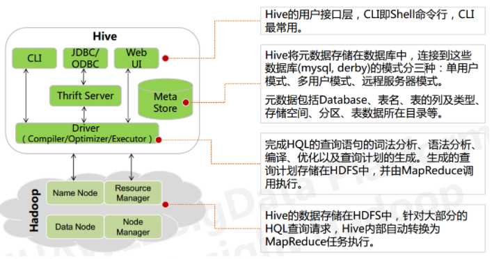

# 背景

Hive 依赖于 HDFS 存储数据，Hive 将 HQL 转换成 MapReduce 执行，所以说 Hive 是基于 Hadoop 的一个数据仓库工具，实质就是一款基于 HDFS 的 MapReduce 计算框架，对存储在 HDFS 中的数据进行分析和管理

# 架构



用户接口: shell/CLI, jdbc/odbc, webui Command Line Interface

跨语言服务 ： thrift server 提供了一种能力，让用户可以使用多种不同的语言来操纵hive

底层的Driver： 驱动器Driver，编译器Compiler，优化器Optimizer，执行器Executor

元数据存储系统 ： RDBMS MySQL

# 数据组织

Hive 的存储结构包括**数据库、表、视图、分区和表数据**等

Hive 中包含以下数据模型：

　　**database**：在 HDFS 中表现为${hive.metastore.warehouse.dir}目录下一个文件夹

　　**table**：在 HDFS 中表现所属 database 目录下一个文件夹

　　**external table**：与 table 类似，不过其数据存放位置可以指定任意 HDFS 目录路径

　　**partition**：在 HDFS 中表现为 table 目录下的子目录

　　**bucket**：在 HDFS 中表现为同一个表目录或者分区目录下根据某个字段的值进行 hash 散 列之后的多个文件

　　**view**：与传统数据库类似，只读，基于基本表创建

## 外部表、内部表

从技术上来说，被 external 关键字修饰的就是外部表（external table），未被 external 修饰的表是管理表（managed table）。

- 外部表的数据由 hdfs 管理，而内部表的数据由 hive 管理。
- 内部表数据存储的位置是hive.metastore.warehouse.dir（默认：/user/hive/warehouse），外部表数据的存储位置由自己制定（如果没有LOCATION，Hive将在HDFS上的/user/hive/warehouse文件夹下以外部表的表名创建一个文件夹，并将属于这个表的数据存放在这里）；
- 删除内部表会直接删除元数据（metadata）及存储数据；删除外部表仅仅会删除元数据，HDFS上的文件并不会被删除；
- 对内部表的修改会将修改直接同步给元数据，而对外部表的表结构和分区进行修改，则需要修复（MSCK REPAIR TABLE table_name）

**一般很少用insert （不是insert overwrite）语句，因为就算就算插入一条数据，也会调用MapReduce，这里我们选择Load Data的方式。**

## 分区

一个分区对应一个目录

load， insert的时候要带上分区

## 分桶

分桶之前要执行命令hive.enforce.bucketiong=true;

要使用关键字clustered by 指定分区依据的列名，还要指定分为多少桶，这里指定分为3桶。

桶给表加上了额外的结构，在进行某些查询的时候可以利用这个结构进行高效的查询

例如：对于两个数据表，某两列都做了桶划分，可以使用map端的join高效的完成join（桶和桶之间的join，大大减少了join的次数）。

对于map端连接的情况，两个表以相同方式划分桶。处理左边表内某个桶的 mapper 知道右边表内相匹配的行在对应的桶内。

因此，mapper只需要获取那个桶 (这只是右边表内存储数据的一小部分)即可进行连接”

# 数据类型

**原始数据类型**

- 整型
  TINYINT — 微整型，只占用1个字节，只能存储0-255的整数。
  SMALLINT– 小整型，占用2个字节，存储范围–32768 到 32767。
  INT– 整型，占用4个字节，存储范围-2147483648到2147483647。
  BIGINT– 长整型，占用8个字节，存储范围-263到263-1。
- 布尔型
  BOOLEAN — TRUE/FALSE
- 浮点型
  FLOAT– 单精度浮点数。
  DOUBLE– 双精度浮点数。
- 字符串型
  STRING– 不设定长度。

**复合数据类型**

- Structs：一组由任意数据类型组成的结构。比如，定义一个字段C的类型为STRUCT {a INT; b STRING}，则可以使用a和C.b来获取其中的元素值；
- Maps：一组无序的键/值对。键的类型必须是原子的，值可以是任何类型，同一个映射的键的类型必须相同，值得类型也必须相同
- Arrays：一组有序字段。字段的类型必须相同

　hive不支持日期类型，在hive里日期都是用字符串来表示的，而常用的日期格式转化操作则是通过自定义函数进行操作。

# hive存储格式

首先大数据的查询和处理有以下几个需求：

1. **数据的快速加载**
2. **数据的快速查询处理**
3. **高效的存储，减少存储空间的使用**
4. **能很好的适应动态的查询模式**

**行式存储的适用场景包括：**

> 1、适合随机的增删改查操作;
>
> 2、需要在行中选取所有属性的查询操作;
>
> 3、需要频繁插入或更新的操作。

**列式存储引擎的适用场景包括：**

> 1、查询过程中，可针对各列的运算并发执行(SMP)，最后在内存中聚合完整记录集，最大可能降低查询响应时间;
>
> 2、可在数据列中高效查找数据，无需维护索引(任何列都能作为索引)，查询过程中能够尽量减少无关IO，避免全表扫描;
>
> 3、各列独立存储，且数据类型已知，可以针对该列的数据类型、数据量大小等因素动态选择压缩算法，以提高物理存储利用率。

对于数据仓库和分布式数据库来说，大部分情况下它会从各个数据源汇总数据，然后进行分析和反馈，其操作大多是围绕同一列属性的数据进行的，而当查询某属性的数据记录时，列式数据库只需返回与列属性相关的值，在大数据量查询场景中，列式数据库可在内存中高效组装各列的值，最终形成关系记录集，因此可以显著减少IO消耗，并降低查询响应时间，适合数据仓库和分布式的应用。


在建表时使用
**STORED AS (**
**TextFile|RCFile|SequenceFile|AVRO|ORC|Parquet**
**)**
来指定存储格式

textfile

> textfile为默认格式
> 存储方式：行存储
> 磁盘开销大 数据解析开销大
> 压缩的text文件 hive无法进行合并和拆分
> **textfile 存储空间消耗比较大，并且压缩的text 无法分割和合并 查询的效率最低,可以直接存储，加载数据的速度最高**

sequencefile

> 二进制文件,以key-value的形式序列化到文件中
> 存储方式：行存储
> 可分割 压缩
> 一般选择block压缩
> 优势是文件和hadoop api中的mapfile是相互兼容的。
>
> **sequencefile 存储空间消耗最大,压缩的文件可以分割和合并 查询效率高，需要通过text文件转化来加载**

rcfile

> 存储方式：数据按行分块 每块按照列存储
> 压缩快 快速列存取
> 读记录尽量涉及到的block最少
> 读取需要的列只需要读取每个row group 的头部定义。
> 读取全量数据的操作 性能可能比sequencefile没有明显的优势
>
> **rcfile 存储空间最小，查询的效率最高 ，需要通过text文件转化来加载，加载的速度最低**

 **Parquet**是一个面向列的二进制文件格式。Parquet对于大型查询的类型是高效的。对于扫描特定表格中的特定列的查询，Parquet特别有用。Parquet桌子使用压缩Snappy，gzip;目前Snappy默认。

  **AVRO**
是开源项目，为Hadoop提供数据序列化和数据交换服务。您可以在Hadoop生态系统和以任何编程语言编写的程序之间交换数据。Avro是基于大数据Hadoop的应用程序中流行的文件格式之一。

# 数据压缩


hive 的数据压缩 == MR的数据压缩

**1.在哪个阶段进行数据压缩**

MR阶段过程：

  input  -> map   -> shuffle  ->  reduce  ->  output
shuffle 阶段几个重要内容：

  分区   ->  排序   -> combiner(map端的reduce)  -> 压缩   -> 分组

map阶段输出数据压缩 ，在这个阶段，优先选择一个低CPU开销的算法。

```
set hive.exec.compress.intermediate=trueset mapred.map.output.compression.codec= org.apache.hadoop.io.compress.SnappyCodecset mapred.map.output.compression.codec=com.hadoop.compression.lzo.LzoCodec;
```

 对最终输出结果压缩

```
set hive.exec.compress.output=true set mapred.output.compression.codec=org.apache.hadoop.io.compress.SnappyCodec ## 当然，也可以在hive建表时指定表的文件格式和压缩编码
```

**2.为什么要数据压缩**

- 节省磁盘空间
- 减小网络IO、磁盘IO

**3.有哪些数据压缩方案**

```bash
  zlib 
  gzip
  bzip2
  snappy（google 企业应用）
  lz4
  lzo
```

- 节省存储空间：bzip2 > gzip > lzo
- 解压速度：lzo > gzip > bzip2

spark推荐Parquet+Snappy

安装snappy:<https://blog.csdn.net/weixin_45366499/article/details/109271630>

配置**mapred-site.xml**

~~~
        <property>
        <name>hive.exec.compress.intermediate</name>
        <value>true</value>
        </property>

        <property>
        <name>hive.exec.compress.output</name>
        <value>true</value>
        </property>

        <property>
        <name>mapreduce.map.output.compress</name>
        <value>true</value>
        </property>

        <property>
        <name>mapreduce.output.fileoutputformat.compress</name>
        <value>true</value>
        </property>

        <property>
        <name>mapreduce.map.output.compress.codec</name>
        <value>org.apache.hadoop.io.compress.SnappyCodec</value>
        </property>

        <property>
        <name>mapreduce.output.fileoutputformat.compress.codec</name>
        <value>org.apache.hadoop.io.compress.SnappyCodec</value>
        </property>

~~~

# hive如何将Hql转化为MapReduce

1. 解释器完成词法、语法和语义的分析以及中间代码生成，最终转换成抽象语法树；
2. 编译器将语法树编译为逻辑执行计划；
3. 逻辑层优化器对逻辑执行计划进行优化，由于Hive最终生成的MapReduce任务中，Map阶段和Reduce阶段均由OperatorTree组成，所以大部分逻辑层优化器通过变换OperatorTree，合并操作符，达到减少MapReduce Job和减少shuffle数据量的目的；
4. 物理层优化器进行MapReduce任务的变换，生成最终的物理执行计划；
5. 执行器调用底层的运行框架执行最终的物理执行计划。

# hive排序函数的区别

- order by
  order by 会对数据进行全局排序,和oracle和mysql等数据库中的order by 效果一样，它**只在一个reduce中进行所以数据量特别大的时候效率非常低。**
  而且当设置 ：**set hive.mapred.mode=strict的时候不指定limit**，执行select会报错，如下：
  LIMIT must also be specified。
- sort by
  **sort by 是单独在各自的reduce中进行排序，所以并不能保证全局有序，一般和distribute by 一起执行，而且distribute by 要写在sort by前面。**
  如果mapred.reduce.tasks=1和order by效果一样，如果大于1会分成几个文件输出每个文件会按照指定的字段排序，而不保证全局有序。
  sort by 不受 hive.mapred.mode 是否为strict ,nostrict 的影响。
- distribute by
  DISTRIBUTE BY 控制map 中的输出在 reducer 中是如何进行划分的。使用DISTRIBUTE BY 可以保证相同KEY的记录被划分到一个Reduce 中。
- cluster by
  distribute by 和 sort by 合用就相当于cluster by，但是cluster by 不能指定排序为asc或 desc 的规则，只能是升序排列

# UDF相关内容

UDF（User-Defined Functions）即是用户自定义的hive函数。当 Hive 自带的函数并不能完全满足业务的需求，这时可以根据具体需求自定义函数。UDF 函数可以直接应用于 select 语句，对查询结构做格式化处理后，再输出内容。

Hive 自定义函数包括三种：

- UDF: one to one ，进来一个出去一个，row mapping， 如：upper、substr函数；
- UDAF(A：aggregation): many to one，进来多个出去一个，row mapping，如sum/min；
- UDTF(T：table-generating)：one to mang，进来一个出去多行，如 lateral view 与 explode 。

# 数据倾斜与优化

确保查询本身没问题：没有多查数据，没有少查

确保没有大量小文件

## join无关的优化

### group by引起的倾斜优化

比如，假设按照供应商对销售明细事实表来统计订单数，那么部分大供应商的订单量显然非常多，而多数供应商的订单量就一般，由于 group by 的时候是按照供应商的 ID 分发到每个 Reduce Task ，那么此时分配到大供应商的 Reduce Task 就分配了更多的订单，从而导致数据倾斜。

对于 group by 引起的倾斜，优化措施非常简单，只需设置下面参数即可：

```
set hive.map.aggr = true 
set hive.groupby.skewindata=true
```

此时 Hive 在数据倾斜的时候会进行负载均衡，生成的查询计划会有两个 MapReduce Job。

- 第一个 MapReduce Job 中，Map 的输出结果集合会随机分布到 Reduce 中，每个Reduce 做部分聚合操作并输出结果。这样处理的结果是相同的 GroupBy Key 有可能被分布到不同的 Reduce 中，从而达到负载均衡的目的；
- 第二个 MapReduce Job 再根据预处理的数据结果，按照 GroupBy Key 分布到 Reduce 中（这过程可以保证相同的GroupBy Key被分布到同一个Reduce中），最后完成最终的聚合操作。

### count distinct 优化

由于必须去重，因此 Hive 将会把 Map 阶段的输出全部分布到 Reduce Task 上，此时很容易引起性能问题。对于这种情况，可以通过先 group by 再 count 的方式来优化，优化后的 SQL 如下：

```
select count(*) from (
 select user 
 from some_table 
 group by user
 ) tmp;
```

## 大表 Join 小表优化

只需添加 `mapjoin hint` 即可，优化后的 SQL 如下

~~~
select /*+mapjoin(b)*/ 
~~~

mapjoin 优化是在 Map 阶段进行 join ，而不是像通常那样在 Reduce 阶段按照 join 列进行分发后在每个 Reduce 任务节点上进行 join ，不需要分发也就没有倾斜的问题，相**反 Hive 会将小表全量复制到每个 Map 任务节点（对于本例是 dim_seller ，当然仅全量复制 b表 sql 指定的列）**，然后每个 Map 任务节点执行 lookup 小表即可。

**「从上述分析可以看出，小表不能太大，否则全量复制分发得不偿失。」**

- 实际上 Hive 根据参数 `hive.mapjoin.smalltable.filesize` ( 0.11.0 本后是 `hive.auto.convert.join.noconditionaltask.size` ）来确定小表的大小是否满足条件（默认 25M）。
- 实际中此参数值所允许的最大值可以修改，但是一般最大不能超过 1GB （太大的话 Map 任务所在的节点内存会撑爆， Hive 会报错 。另外需要注意的是， HDFS 显示的文件大小是压缩后的大小， 当实际加载到内存的时候，容量会增大很多，很多场景下可能会膨胀 10 倍）。

## 大表 Join 大表优化

我们先假设一个问题场景：

> ❝
>
> A 表为一个汇总表，汇总的是卖家买家最近 N 天交易汇总信息，即对于每个卖家最近 N 天，其每个买家共成交了多少单、总金额是多少，我们这里 N 先只取 90 天，汇总值仅取成交单数 。A 表的字段有：`buyer_id 、seller_id 和 pay_cnt_90d` 。
>
> ❞

> ❝
>
> B 表为卖家基本信息表，其中包含卖家的一个分层评级信息，比如把卖家分为 6 个级别：S0、S1、S2、S3、S4、S5、S6 。
>
> ❞

要获得的结果是每个买家在各个级别卖家的成交比例信息，比如：

某买家 S0:10%; S1:20%; S2:20%; S3:10%; S4:20%; S4:10%; S5:10%。

B表的字段有：seller_id 和 s_level。

> 但是此 SQL 会引起数据倾斜，原因在于卖家的二八准则。某些卖家 90 天内会有几百万甚至上千万的买家，但是大部分卖家 90 天内的买家数目并不多， join table_A 和table_B 的时候 ODPS 会按照 Seller_id 进行分发， table_A 的大卖家引起了数据倾斜。
>
> ❞

**「但是本数据倾斜问题无法用 mapjoin table_B 解决，因为卖家有超过千万条、文件大小几个GB ，超过了 mapjoin 表最大 1GB 的限制。」**

### 方案 1：转化为 mapjoin

大表无法直接mapjoin，那么是否可以间接呢？实际上此思路有两种途径：限制行和限制列。

- 限制行: 不需要join B全表，只需要join其在A表中存在的。对于本问题场景，就是过滤掉 90 天内没有成交的卖家。
- 限制列: 只取需要的字段。

~~~
select 
m.buyer_id 
,sum(pay_cnt_90d) as pay_cnt_90d 
,sum(case when m.s_level=O then pay_cnt_90d end) as pay_cnt_90d_s0 
,sum(case when m.s_level=l then pay_cnt_90d end) as pay_cnt_90d_sl 
,sum(case when m.s_level=2 then pay_cnt_90d end) as pay_cnt_90d_s2 
,sum(case when m.s level=3 then pay cnt 90d end) as pay_cnt_90d_s3
,sum(case when m.s_level=4 then pay_cnt_90d end) as pay_cnt_90d_s4 
,sum(case when m.s_level=S then pay_cnt_90d end) as pay_cnt_90d_s5 
from 
(
select /*+mapjoin(b)*/
a.buyer_id,a.seller_id,b.s_level,a.pay_cnt_90d 
from 
(
select buyer_id ,seller_id,pay_cnt_90d 
from table_A 
) a 
join 
(
select b0.seller id,s_level 
from table_B b0
    join
    (select seller_id from table_A group by seller_id) a0
    on b0.seller_id=a0.seller_id
) b 
on a.seller_id=b.seller_id 
) m 
group by m.buyer_id
~~~

### 方案 2：join 时用 case when 语句

将这些引起倾斜的值随机分发到Reduce，其主要核心逻辑在于 join 时对这些特殊值concat 随机数,从而达到随机分发的目的。核心逻辑如下：

```
Select a.user_id,a.order_id,b.user_id 
From table_a a 
Join table_b b 
On (case when a.user_id is null then concat ('hive' ,rand()) else a.user_id end)=b.user_id
```

Hive已对此进行了优化，不需要修改SQL，只需要设置参数；比如 table_B 的值 "0" 和 "1" 引起倾斜，只需要如下设置：

```
set hive.optimize.skewinfo=table_B:(seller_id)[("0")("1")];
set hive.optimize.skewjoin=true;
```

> ❝
>
> 但是方案二还是不能解决上述问题，因为倾斜的卖家大量存在而且动态变化。

### 方案 3：倍数B表，再取模join

- 通用方案

是建立一个numbers表,其值只有一列int行，比如从1到10(具体根据倾斜程度确定)，然后放大B表10倍，再取模join。

```
select m
     , buer_id
     , sum(pay_cnt_90d)                                  as pay_cnt_90d
     , sum(case when m.s_level = O then pay_cnt_90d end) as pay cnt 90d so
     , sum(case when m.s_level = l then pay cnt 90d end) as pay cnt 90d_sl
     , sum(case when m.s_level = 2 then pay_cnt_90d end) as pay_cnt_90d s2
     , sum(case when m.s_level = 3 then pay_cnt_90d end) as pay_cnt_90d_s3
     , sum(case when m.s_level = 4 then pay_cnt_90d end) as pay cnt 90d s4
     , sum(case when m.s level=S then pay cnt 90d end)   as pay cnt 90d s5
from (
         select a.buyer_id,
                a.seller_id,
                b.s_level,
                a.pay_cnt_90d
         from (
                  select buyer_id, seller_id, pay_cnt_90d
                  from table_A
              ) a
                  JOin
              (
                  select /*+mapjoin(members)*/
                      seller_id,
                      s_level,
                      member
                  from table_B
                           join
                       numbers
              ) b
              on a.seller_id = b.seller_id
                  and mod(a.pay_cnt_90d, 10) + 1 = b.number
     ) m
group by m.buyer_id
```

> ❝
>
> 思路核心在于：既然按照seller_id分发会倾斜，那么再人工增加一列进行分发，这样之前倾斜的值的倾斜程度会减少为原来的1/10。可以通过配置numbers表修改放大倍数来降低倾斜程度，但弊端就是B表会膨胀N倍。
>
> ❞

- 专有方案

通用方案思路是把B表的每条数据都放大了相同的倍数，实际上只需要把大卖家放大倍数即可。

首先需要知道大卖家的名单，即先建立一个临时表动态存放每日最新的大卖家（比如dim_big_seller），同时此表的大卖家要膨胀预先设定的倍数（比如1000倍）。

在A表和 B表中分别新建一个 join 列，其逻辑为：如果是大卖家，那么 concat 一个随 机分配正整数（0到预定义的倍数之间，本例为0~1000 ）；如果不是，保持不变。


相比通用方案，专用方案的运行效率明显好了很多，因为只是将B表中大卖家的行数放大了 1000 倍，其他卖家的行数保持不变，但同时也可以看到代码也复杂了很多，而且必须首先建立大卖家表。

### 方案 4：动态一分为二

实际上方案 2 和 3 都用到了一分为二的思想，但是都不彻底，对于 mapjoin 不能解决的 问题，终极解决方案就是动态一分为 ，即对倾斜的键值和不倾斜的键值分开处理，不倾 斜的正常 join 即可，倾斜的把它们找出来然后做 mapjoin ，最后 union all 其结果即可。

但是此种解决方案比较麻烦，代码会变得复杂而且需要一个临时表存放倾斜的键值。


```
-- 对于 90 天买家数超过 10000 的卖家直接 map join ，对于其他卖家正常 join 即可
select 
m.buyer_id 
,surn(pay_cnt_90d) as pay_cnt_90d 
,surn(case when rn.s_level=O then pay_cnt_90d end) as pay_cnt_90d_s0 
,surn(case when rn.s_level=l then pay_cnt_90d end) as pay_cnt_90d_sl 
,surn(case when rn.s_level=2 then pay_cnt_90d end) as pay_cnt_90d_s2 
,surn(case when rn.s_level=3 then pay_cnt_90d end) as pay_cnt_90d_s3 
,surn(case when rn.s_level=4 then pay_cnt_90d end) as pay_cnt_90d_s4 
,surn(case when rn.s_level=S then pay_cnt_90d end) as pay_cnt_90d_s5
from
(
select 
    a.buyer_id,a.seller_id,b.s_level,a.pay_cnt_90d
    from
    (
    select buyer_id,seller_id,pay_cnt_90d
        from table_A
    ) a
    join
    (
     select seller_id ,a.s_level
        from table_A a
        left outer join tmp_table_B b
        on a.user_id = b.seller_id
        where b.seller_id is null
    ) b 
on a.seller id=b.seller id 
union all 
select /*+mapjoin(b)*/ 
a.buyer_id,a.seller_id,b.s_level,a.pay_cnt_90d 
from 
select buyer_id,seller_id,pay_cnt_90d 
from table A 
) a 
join 
select seller_id,s_level 
from table B 
) b 
on a.seller id=b.seller id
) m group by m.buyer_id
) m
group by m.byer_id
```

总结起来，方案 1、2 以及方案 3 中的通用方案不能保证解决大表 join 大表问题，因为它们都存在种种不同的限制和特定的使用场景。

而方案 3 的专用方案和方案 4 是比较推荐的优化方案，但是它们都需要新建一个临时表来存放每日动态变化的大卖家 。

相对方案 4 来说，方案 3 的专用方案不需要对代码框架进行修改，但是 B 表会被放大，所以一定要是维度表，不然统计结果会是错误的 。方案 4 的解决方案最通用，自由度最高，但是对代码的更改也最大，甚至需要更改代码框架，可作为终极方案来使用。

# 参数调优

~~~
// 让可以不走mapreduce任务的，就不走mapreduce任务
hive> set hive.fetch.task.conversion=more;
 
// 开启任务并行执行
 set hive.exec.parallel=true;
// 解释：当一个sql中有多个job时候，且这多个job之间没有依赖，则可以让顺序执行变为并行执行（一般为用到union all的时候）
 
 // 同一个sql允许并行任务的最大线程数 
set hive.exec.parallel.thread.number=8;
 
// 设置jvm重用
// JVM重用对hive的性能具有非常大的 影响，特别是对于很难避免小文件的场景或者task特别多的场景，这类场景大多数执行时间都很短。jvm的启动过程可能会造成相当大的开销，尤其是执行的job包含有成千上万个task任务的情况。
set mapred.job.reuse.jvm.num.tasks=10; 
 
// 合理设置reduce的数目
// 方法1：调整每个reduce所接受的数据量大小
set hive.exec.reducers.bytes.per.reducer=500000000; （500M）
// 方法2：直接设置reduce数量
set mapred.reduce.tasks = 20

// map端聚合，降低传给reduce的数据量


set hive.map.aggr=true  
 // 开启hive内置的数倾优化机制

set hive.groupby.skewindata=true
~~~

# sql优化

~~~
1
where条件优化

优化前（关系数据库不用考虑会自动优化）

select m.cid,u.id from order m join customer u on( m.cid =u.id )where m.dt='20180808';

优化后(where条件在map端执行而不是在reduce端执行）

select m.cid,u.id from （select * from order where dt='20180818'） m join customer u on( m.cid =u.id);


2
union优化

尽量不要使用union （union 去掉重复的记录）而是使用 union all 然后在用group by 去重

3
count distinct优化

不要使用count (distinct  cloumn) ,使用子查询

select count(1) from (select id from tablename group by id) tmp;


4
用in 来代替join


如果需要根据一个表的字段来约束另为一个表，尽量用in来代替join . in 要比join 快

select id,name from tb1  a join tb2 b on(a.id = b.id);
 
select id,name from tb1 where id in(select id from tb2);

5
优化子查询

消灭子查询内的 group by 、 COUNT(DISTINCT)，MAX，MIN。可以减少job的数量。


6
join 优化

Common/shuffle/Reduce JOIN 连接发生的阶段，发生在reduce 阶段， 适用于大表 连接 大表(默认的方式)

Map join ：连接发生在map阶段 ， 适用于小表 连接 大表
                       大表的数据从文件中读取
                       小表的数据存放在内存中（hive中已经自动进行了优化，自动判断小表，然后进行缓存）

set hive.auto.convert.join=true;


SMB join
   Sort -Merge -Bucket Join  对大表连接大表的优化，用桶表的概念来进行优化。在一个桶内发生笛卡尔积连接（需要是两个桶表进行join）


 set hive.auto.convert.sortmerge.join=true;  
 set hive.optimize.bucketmapjoin = true;  
 set hive.optimize.bucketmapjoin.sortedmerge = true;  
set hive.auto.convert.sortmerge.join.noconditionaltask=true;
~~~


