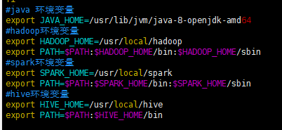
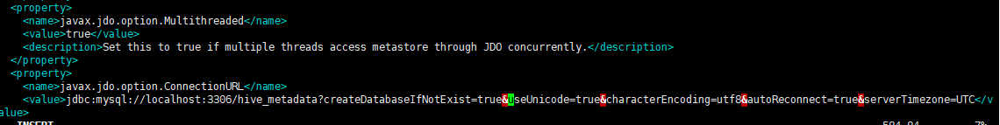
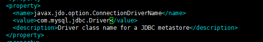
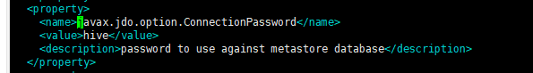
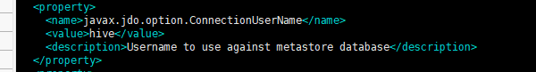
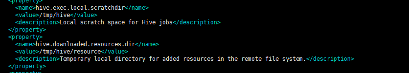
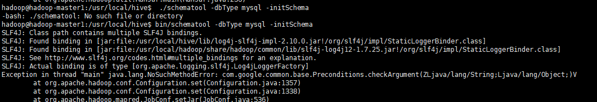

# 下载

对应hadoop版本

http://archive.apache.org/dist/hive/hive-3.1.2/

~~~
sudo tar -zxf apache-hive-3.1.2-bin.tar.gz -C /usr/local
cd /usr/local/
sudo mv ./apache-hive-~/.bashrc.1.2-bin/ ./hive
vim ~/.bashrc
export HIVE_HOME=/usr/local/hive
export PATH=$PATH:$HIVE_HOME/bin
~~~

# 元数据mysql安装

https://zhuanlan.zhihu.com/p/75891315

mysql.ini

~~~
[mysql]

# 设置mysql客户端默认字符集
default-character-set=utf8

[mysqld]

# 设置3306端口
port = 3306

# 设置mysql的安装目录
basedir=C:\Program Files\MySQL

# 设置mysql数据库的数据的存放目录
datadir=C:\Program Files\MySQL\data

# 允许最大连接数
max_connections=20

# 服务端使用的字符集默认为8比特编码的latin1字符集
character-set-server=utf8

# 创建新表时将使用的默认存储引擎
default-storage-engine=INNODB
~~~

执行

~~~
.\mysqld.exe install
.\mysqld.exe --initialize --console 
net start mysql
mysql -u root -p
ALTER USER 'root'@'localhost' identified with mysql_native_password by '<你的密码>';

~~~

配置hive元数据库

~~~
create database hive_metadata;
create user 'hive'@'localhost' identified by 'hive';
# 经常有人在创建操作用户的时候不指定WITH GRANT OPTION选项导致后来该用户不能使用GRANT命令创建用户或者给其它用户授权。不安全吗
grant all privileges on hive_metadata.* to 'hive'@'%' with grant option;
~~~

# 配置 hive-site.xml

https://blog.csdn.net/jiandequn/article/details/102938350

~~~

jdbc:mysql://192.168.56.1:3306/hive_metadata?createDatabaseIfNotExist=true&amp;useUnicode=true&amp;characterEncoding=utf8&amp;autoReconnect=true&amp;serverTimezone=UTC
com.mysql.jdbc.Driver
~~~

~~~

~~~

# 失败

cp  /usr/local/hadoop/share/hadoop/common/lib/guava-27.0-jre.jar /usr/local/hive/lib/

rm /usr/local/hive/lib/guava-19.0.jar 