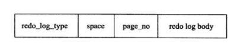
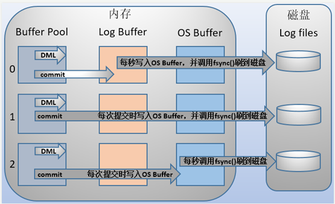

# MySQL中myisam与innodb的区别，至少5点


1. 存储结构

  MyISAM：每个MyISAM在磁盘上存储成三个文件。第一个文件的名字以表的名字开始，扩展名指出文件类型。 .frm文件存储表定义。数据文件的扩展名为.MYD(MYD)。索引文件的扩展名是.MYI(MYIndex)。

  InnoDB:所在的表都保存在同一个数据文件中（也可能是多个文件，或者是独立的表空间），InnoDB表的大小只受限于操作系统文件的大小，一般为2GB。

2. 存储空间

​     MyISAM:可被压缩，存储空间较小。支持三种不同的存储格式：静态表（默认，但是注意数据末尾不能有空格，会被去掉）、动态表、压缩表。

​     InnoDB:需要更多的内存和存储，它会在主内存中建立其专用的缓冲池用于高速缓冲数据和索引。

3. 事物支持

MyISAM:强调的是性能，每次查询具有原子性，其执行速度比Innodb类型更快，但是不提供事物支持。

InnoDB:提供事务支持，外部键等高级数据库功能。具有事务（commit）、回滚（rollback）和崩溃修复能力（crach recovery capabilities）的事务安全（transaction-safe ACID compliant）型表。

4. CURD操作

MyISAM: 如果执行大量的select, MyISAM是更好的选择。（因为没有支持行级锁），在增删的时候需要锁定整个表格，效率会低一些。相关的是innoDB支持行级锁，删除插入的时候只需要锁定该行就行，效率较高。

InnoDB:如果你的数据执行大量的insert或update，出于性能方面的考虑，应该使用InnoDB表。Delete从性能上Innodb更优，但delete from table时，InnoDB不会重新建立表，而是一行一行的删除，在innodb上如果要清空保存有大量数据的表，最好使用truncate table这个命令。

5. 外键

MyISAM: 不支持。

InoDB:支持。
（2）各种不同mysql版本的2者的改进
（3）2者的索引的实现方式

# innodb引擎内存布局

https://blog.haohtml.com/archives/19232


在 InnoDB 中存在两种表空间的类型：共享表空间和独立表空间。如果是共享表空间就意味着多张表共用一个表空间。如果是独立表空间，就意味着每张表有一个独立的表空间，也就是数据和索引信息都会保存在自己的表空间中。独立的表空间可以在不同的数据库之间进行迁移。可通过命令

```
`mysql > show variables like 'innodb_file_per_table';`
```

查看当前系统启用的表空间类型。目前最新版本已经默认启用独立表空间。

InnoDB把数据保存在表空间内，表空间可以看作是InnoDB存储引擎逻辑结构的最高层。本质上是一个由一个或多个磁盘文件组成的虚拟文件系统。InnoDB用表空间并不只是存储表和索引，还保存了回滚段、双写缓冲区等。

段（Segment）由一个或多个区组成，区在文件系统是一个**连续分配**的空间（在 InnoDB 中是连续的 64 个页），不过在段中不要求区与区之间是相邻的。段是数据库中的分配单位，不同类型的数据库对象以不同的段形式存在。

在 InnoDB 存储引擎中，一个区会分配 64 个连续的页。因为 InnoDB 中的页大小默认是 16KB，所以一个区的大小是 64*16KB=1MB。在任何情况下每个区大小都为1MB，为了保证页的连续性，InnoDB存储引擎每次从磁盘一次申请4-5个区。默认情况下，InnoDB存储引擎的页大小为16KB，即一个区中有64个连续的页。

页是InnoDB存储引擎磁盘管理的最小单位，每个页默认16KB；InnoDB存储引擎从1.2.x版本碍事，可以通过参数innodb_page_size将页的大小设置为4K、8K、16K。若设置完成，则所有表中页的大小都为innodb_page_size，不可以再次对其进行修改，除非通过mysqldump导入和导出操作来产生新的库。

innoDB存储引擎中，常见的页类型有：

1. 数据页（B-tree Node)

2. undo页（undo Log Page）

3. 系统页 （System Page）

4. 事物数据页 （Transaction System Page）

5. 插入缓冲位图页（Insert Buffer Bitmap）

6. 插入缓冲空闲列表页（Insert Buffer Free List）

7. 未压缩的二进制大对象页（Uncompressed BLOB Page）

8. 压缩的二进制大对象页 （compressed BLOB Page）

InnoDB存储引擎是按行进行存放的，每个页存放的行记录也是有硬性定义的，最多允许存放16KB/2-200，即7992行记录。


# innodb特性

## 一、插入缓冲insert buffer

1. 目的：提升插入性能；

2. 使用插入缓冲的条件：

3. 1. 非聚集索引；
   2. 非唯一索引；
   3. 就是说必须是辅助索引且非唯一索引；
   4. 为何？insert buffer的设计是为了避免读取索引页，如果是唯一索引，在插入时需要判断插入的记录是否唯一，这需要读取辅助索引页，导致失去insert buffer的设计意义；

4. 插入缓冲：change buffer是对insert buffer的加强，insert buffer只对insert有效，change buffer对insert、delete、update（delete+insert）、purge都有效；

5. change buffer作为buffer pool的一部分，innodb_change_buffering参数的值有：

6. 1. all：默认值，缓存insert、delete、purge操作；
   2. inserts：缓存insert操作；
   3. deletes：缓存delete操作；
   4. changes：缓存insert、delete操作；
   5. purges：缓存后台执行的物理删除操作；
   6. none：不缓存；

7. innodb_change_buffer_max_size参数：控制使用的大小，默认25%，最大可设置50%，如果mysql实例中有大量的修改操作，可考虑增大该参数；

8. insert buffer的数据结构是一颗B+树；

9. 1. 全局只有一颗insert buffer B+树，负责对所有表的辅助索引进行insert buffer；
   2. 这颗B+树放在共享表空间中，试图通过独立表空间ibd文件恢复表中数据时，往往会导致check table失败，因为表中的辅助索引中的数据可能还在insert buffer中，也就是共享表空间中，所以ibd文件恢复后，还需要repair table操作来重建表上所有的辅助索引；

10. 对满足插入缓存条件的插入，每一次的插入不是写到索引页中；

11. 1. 会先判断插入的非聚集索引页是否在缓冲池中，如果在直接插入；
    2. 如果不在，则先放到insert buffer中，再按照一定的频率进行合并操作，再写会磁盘；
    3. 通常可以将多个插入合并到一个操作中，目的是为了减少随机IO带来的性能损耗；

12. 一定频率进行合并操作，这个频率有什么条件？

13. 1. 辅助索引页被读取到缓冲池中，正常的select先检查insert buffer是否有该非聚集索引页存在，有则合并插入；
    2. 辅助索引页没有可用空间。空间小于1/32页大小，会强制合并操作；
    3. master thread每秒和每10秒的合并操作；

## 二、二次写double write

1. doublewrite缓存位于系统表空间的存储区域，用来缓存innodb的数据页从innodb buffer pool中flush之后并写入到数据文件之前；
2. 当操作系统或数据库进程在数据页写入磁盘的过程中崩溃，可以在doublewrite缓存中找到数据页的备份，用来执行crash恢复；
3. 数据页写入到doublewrite缓存的动作所需要的io消耗要小于写入到数据文件的消耗，因为此写入操作会以一次大的连续块的方式写入；


根据上图知道：

1. 1. 内存中doublewrite buffer大小2M；物理磁盘上共享表空间中连续的128个页，也就是2个区（extent）大小同样为2M；

   2. 对缓冲池脏页进行刷新时，不是直接写磁盘。

   3. 1. 第一步：通过memcpy()函数将脏页先复制到内存中的doublewrite buffer；
      2. 第二步：通过doublewrite分两次，每次1M顺序的写入共享表空间的物理磁盘上。这个过程中，doublewrite页是连续的，因此这个过程是顺序的，所以开销并不大；
      3. 第三步：完成doublewrite页的写入后，再将doublewrite buffer中的页写入各个表空间文件中，此时写入是离散的，可能会较慢；
      4. 如果操作系统在第三步的过程中发生了崩溃，在恢复过程中，可以从共享表空间中的doublewrite中找到该页的一个副本，将其复制到表空间文件中，再应用重做日志；

## 三、自适应hash索引ahi

1. innodb存储引擎会监控对表上二级索引的查找，如果发现某二级索引被频繁访问，此索引成为热数据，建立hash索引以提升查询速度，此建立是自动建立哈希索引，故称为自适应哈希索引（adaptive hash index）；
2. 自适应哈希索引会占用innodb buffer pool；
3. 只适合搜索等值（=）的查询，对于范围查找等操作，是不能使用的；

## 四、预读read ahead

1. 两种预读算法来提高性能：

2. 1. 线性预读：以extent为单位，将下一个extent提前读取到buffer pool中；
   2. 随机预读：以extent中的page为单位，将当前extent中的剩余的page提前读取到buffer pool中；

3. 线性预读一个重要参数：innodb_read_ahead_threshold，控制什么时间（访问extent中多少页的阈值）触发预读；

4. 1. 默认：56，范围：0～64，值越高，访问模式检查越严格；
   2. 没有该变量之前，当访问到extent最后一个page时，innodb会决定是否将下一个extent放入到buffer pool中；

5. 随机预读说明：

6. 1. 当同一个extent的一些page在buffer pool中发现时，innodb会将extent中剩余page一并读取到buffer pool中；
   2. 随机预读给innodb code带来一些不必要的复杂性，性能上也不稳定，在5.5版本已经废弃，如果启用，需要修改变量：innodb_random_read_ahead为ON；

# innodb的恢复行为

在启动innodb的时候，不管上次是正常关闭还是异常关闭，总是会进行恢复操作。

因为redo log记录的是数据页的物理变化，因此恢复的时候速度比逻辑日志(如二进制日志)要快很多。而且，innodb自身也做了一定程度的优化，让恢复速度变得更快。

重启innodb时，checkpoint表示已经完整刷到磁盘上data page上的LSN，因此恢复时仅需要恢复从checkpoint开始的日志部分。例如，当数据库在上一次checkpoint的LSN为10000时宕机，且事务是已经提交过的状态。启动数据库时会检查磁盘中数据页的LSN，如果数据页的LSN小于日志中的LSN，则会从检查点开始恢复。

还有一种情况，在宕机前正处于checkpoint的刷盘过程，且数据页的刷盘进度超过了日志页的刷盘进度。这时候一宕机，数据页中记录的LSN就会大于日志页中的LSN，在重启的恢复过程中会检查到这一情况，这时超出日志进度的部分将不会重做，因为这本身就表示已经做过的事情，无需再重做。

另外，事务日志具有幂等性，所以多次操作得到同一结果的行为在日志中只记录一次。而二进制日志不具有幂等性，多次操作会全部记录下来，在恢复的时候会多次执行二进制日志中的记录，速度就慢得多。例如，某记录中id初始值为2，通过update将值设置为了3，后来又设置成了2，在事务日志中记录的将是无变化的页，根本无需恢复；而二进制会记录下两次update操作，恢复时也将执行这两次update操作，速度比事务日志恢复更慢。

# binlog

binlog是Mysql sever层维护的一种二进制日志，与innodb引擎中的redo/undo log是完全不同的日志；其主要是用来记录对mysql数据更新或潜在发生更新的SQL语句，并以"事务"的形式保存在磁盘中；

作用主要有：

- 复制：MySQL Replication在Master端开启binlog，Master把它的二进制日志传递给slaves并回放来达到master-slave数据一致的目的
- 数据恢复：通过mysqlbinlog工具恢复数据
- 增量备份

1.Statement：每一条会修改数据的sql都会记录在binlog中。
优点：不需要记录每一行的变化，减少了binlog日志量，节约了IO，提高性能。(相比row能节约多少性能 与日志量，这个取决于应用的SQL情况，正常同一条记录修改或者插入row格式所产生的日志量还小于Statement产生的日志量，但是考虑到如果带条 件的update操作，以及整表删除，alter表等操作，ROW格式会产生大量日志，因此在考虑是否使用ROW格式日志时应该跟据应用的实际情况，其所 产生的日志量会增加多少，以及带来的IO性能问题。)
缺点：由于记录的只是执行语句，为了这些语句能在slave上正确运行，因此还必须记录每条语句在执行的时候的 一些相关信息，以保证所有语句能在slave得到和在master端执行时候相同 的结果。另外mysql 的复制,像一些特定函数功能，slave可与master上要保持一致会有很多相关问题(如sleep()函数， last_insert_id()，以及user-defined functions(udf)会出现问题).
使用以下函数的语句也无法被复制：

* LOAD_FILE()
* UUID()
* USER()
* FOUND_ROWS()
* SYSDATE() (除非启动时启用了 --sysdate-is-now 选项)
同时在INSERT ...SELECT 会产生比 RBR 更多的行级锁

2.Row:不记录sql语句上下文相关信息，仅保存哪条记录被修改。
优点： binlog中可以不记录执行的sql语句的上下文相关的信息，仅需要记录那一条记录被修改成什么了。所以rowlevel的日志内容会非常清楚的记录下 每一行数据修改的细节。而且不会出现某些特定情况下的存储过程，或function，以及trigger的调用和触发无法被正确复制的问题
缺点:所有的执行的语句当记录到日志中的时候，都将以每行记录的修改来记录，这样可能会产生大量的日志内容,比 如一条update语句，修改多条记录，则binlog中每一条修改都会有记录，这样造成binlog日志量会很大，特别是当执行alter table之类的语句的时候，由于表结构修改，每条记录都发生改变，那么该表每一条记录都会记录到日志中。

3.Mixedlevel: 是以上两种level的混合使用，一般的语句修改使用statment格式保存binlog，如一些函数，statement无法完成主从复制的操作，则 采用row格式保存binlog,MySQL会根据执行的每一条具体的sql语句来区分对待记录的日志形式，也就是在Statement和Row之间选择 一种.新版本的MySQL中队row level模式也被做了优化，并不是所有的修改都会以row level来记录，像遇到表结构变更的时候就会以statement模式来记录。至于update或者delete等修改数据的语句，还是会记录所有行的变更。

```
在一条 SQL 操作了多行数据时， statement 更节省空间， row 更占用空间。但是 row模式更可靠。、
Statement 可能占用空间会相对小一些，传送到 slave 的时间可能也短，但是没有 row模式的可靠。 Row 模式在操作多行数据时更占用空间， 但是可靠。
```

事务执行过程中先写binlog cache（溢出到磁盘），提交的时候，再把binlog cache写入到binlog文件中。

binlog_cache_size

sync_binlog：

0:只提交，不fsync

1:每次都fsync

N:N个事务批量fsync

# MySQL数据库cpu飙升到500%的话他怎么处理

```
当 cpu 飙升到 500%时，先用操作系统命令 top 命令观察是不是 mysqld 占用导致的，如果不是，找出占用高的进程，并进行相关处理。如果是 mysqld 造成的， show processlist，看看里面跑的 session 情况，是不是有消耗资源的 sql 在运行。找出消耗高的 sql，
看看执行计划是否准确， index 是否缺失，或者实在是数据量太大造成。一般来说，肯定要 kill 掉这些线程(同时观察 cpu 使用率是否下降)，等进行相应的调整(比如说加索引、改 sql、改内存参数)之后，再重新跑这些 SQL。也有可能是每个 sql 消耗资源并不多，但是突然之间，
有大量的 session 连进来导致 cpu 飙升，这种情况就需要跟应用一起来分析为何连接数会激增，再做出相应的调整，比如说限制连接数等
```

# redo 日志

https://blog.csdn.net/qq_35246620/article/details/79345359

~~~
innodb_log_buffer_size：# log buffer的大小，默认8M
innodb_log_file_size：#事务日志的大小，默认5M
innodb_log_files_group =2：# 事务日志组中的事务日志文件个数，默认2个
innodb_log_group_home_dir =./：# 事务日志组路径，当前目录表示数据目录
innodb_mirrored_log_groups =1：# 指定事务日志组的镜像组个数，但镜像功能好像是强制关闭的，所以只有一个log group。在MySQL5.7中该变量已经移除。
~~~





redo log通常是物理日志，记录的是数据页的物理修改，而不是某一行或某几行修改成怎样怎样，它用来恢复提交后的物理数据页(恢复数据页，且只能恢复到最后一次提交的位置)

redo log包括两部分：一是内存中的日志缓冲(redo log buffer)，该部分日志是易失性的；二是磁盘上的重做日志文件(redo log file)，该部分日志是持久的。

redo log是追加操作，属于顺序IO。

刷脏是以数据页（Page）为单位的，MySQL默认页大小是16KB，一个Page上一个小修改都要整页写入；而redo log中只包含真正需要写入的部分，无效IO大大减少。

一个固定大小，**“循环写”**的日志文件。

由于更新数据的时候引擎并不是按条更新的，而是以页为最小单位更新。如果没有redolog，每次更新一条数据都要把整页的数据刷新到磁盘。如果更新多条数据，很可能一次就要更新多页，而且这些io是随机io，磁盘i/o就会多且慢。有了redolog，就不需要每次直接按页更新磁盘，而是把更新写到redolog中，然后等空闲时间再把redolog中的更新写入到磁盘。这样做的好处是redolog是顺序写的，而且是按条不是按页写。所以虽然多了一步，实际上是比直接更新快的。

在概念上，innodb通过**force log at commit**机制实现事务的持久性，即在事务提交的时候，必须先将该事务的所有事务日志写入到磁盘上的redo log file和undo log file中进行持久化。为了确保每次日志都能写入到事务日志文件中，在每次将log buffer中的日志写入日志文件的过程中都会调用一次操作系统的fsync操作(即fsync()系统调用)。


MySQL支持用户自定义在commit时如何将log buffer中的日志刷log file中，

innodb_flush_log_at_trx_commit:（0，1，2默认1）

1.  每秒写入os_buffer并调用fsync

2. 每次事务提交都会写入os_buffer并调用fsync
3. 仅写入os_buffer，每秒调用fsync

为了避免多次事务生成日志，更好的插入数据的做法是将值设置为1，然后修改存储过程，将每次循环都提交修改为只提交一次，这样既能保证数据的一致性，也能提升性能。

## 日志刷盘规则

log buffer中未刷到磁盘的日志称为脏日志(dirty log)。

在上面的说过，默认情况下事务每次提交的时候都会刷事务日志到磁盘中，这是因为变量 innodb_flush_log_at_trx_commit 的值为1。但是innodb不仅仅只会在有commit动作后才会刷日志到磁盘，这只是innodb存储引擎刷日志的规则之一。

刷日志到磁盘有以下几种规则：

**1.发出commit动作时。已经说明过，commit发出后是否刷日志由变量 innodb_flush_log_at_trx_commit 控制。**

**2.每秒刷一次。这个刷日志的频率由变量 innodb_flush_log_at_timeout 值决定，默认是1秒。要注意，这个刷日志频率和commit动作无关。**

**3.当log buffer中已经使用的内存超过一半时。**

**4.当有checkpoint时，checkpoint在一定程度上代表了刷到磁盘时日志所处的LSN位置。**

## 数据页刷盘的规则及checkpoint

在innodb中，数据刷盘的规则只有一个：checkpoint。但是触发checkpoint的情况却有几种。不管怎样，checkpoint触发后，会将buffer中脏数据页和脏日志页都刷到磁盘。

innodb存储引擎中checkpoint分为两种：

- sharp checkpoint：在重用redo log文件(例如切换日志文件)的时候，将所有已记录到redo log中对应的脏数据刷到磁盘。
- fuzzy checkpoint：一次只刷一小部分的日志到磁盘，而非将所有脏日志刷盘。有以下几种情况会触发该检查点：
  - master thread checkpoint：由master线程控制，**每秒或每10秒**刷入一定比例的脏页到磁盘。
  - flush_lru_list checkpoint：从MySQL5.6开始可通过 innodb_page_cleaners 变量指定专门负责脏页刷盘的page cleaner线程的个数，该线程的目的是为了保证lru列表有可用的空闲页。
  - async/sync flush checkpoint：同步刷盘还是异步刷盘。例如还有非常多的脏页没刷到磁盘(非常多是多少，有比例控制)，这时候会选择同步刷到磁盘，但这很少出现；如果脏页不是很多，可以选择异步刷到磁盘，如果脏页很少，可以暂时不刷脏页到磁盘
  - dirty page too much checkpoint：脏页太多时强制触发检查点，目的是为了保证缓存有足够的空闲空间。too much的比例由变量 innodb_max_dirty_pages_pct 控制，MySQL 5.6默认的值为75，即当脏页占缓冲池的百分之75后，就强制刷一部分脏页到磁盘。

由于刷脏页需要一定的时间来完成，所以记录检查点的位置是在每次刷盘结束之后才在redo log中标记的。

> MySQL停止时是否将脏数据和脏日志刷入磁盘，由变量innodb_fast_shutdown={ 0|1|2 }控制，默认值为1，即停止时只做一部分purge，忽略大多数flush操作(但至少会刷日志)，在下次启动的时候再flush剩余的内容，实现fast shutdown。





在主从复制结构中，要保证事务的持久性和一致性，需要对日志相关变量设置为如下：

- **如果启用了二进制日志，则设置sync_binlog=1，即每提交一次事务同步写到磁盘中。**
- **总是设置innodb_flush_log_at_trx_commit=1，即每提交一次事务都写到磁盘中。**

上述两项变量的设置保证了：每次提交事务都写入二进制日志和事务日志，并在提交时将它们刷新到磁盘中。


# LSN

LSN称为日志的逻辑序列号(log sequence number)，在innodb存储引擎中，lsn占用8个字节。LSN的值会随着日志的写入而逐渐增大。

根据LSN，可以获取到几个有用的信息：

1.数据页的版本信息。

2.写入的日志总量，通过LSN开始号码和结束号码可以计算出写入的日志量。

3.可知道检查点的位置。

实际上还可以获得很多隐式的信息。

LSN不仅存在于redo log中，还存在于数据页中，在每个数据页的头部，有一个*fil_page_lsn*记录了当前页最终的LSN值是多少。通过数据页中的LSN值和redo log中的LSN值比较，如果页中的LSN值小于redo log中LSN值，则表示数据丢失了一部分，这时候可以通过redo log的记录来恢复到redo log中记录的LSN值时的状态。


# binlog 和redo区别

redo log不是二进制日志。虽然二进制日志中也记录了innodb表的很多操作，**也能实现重做的功能，**但是它们之间有很大区别。

1. 二进制日志是在**存储引擎的上层**产生的，不管是什么存储引擎，对数据库进行了修改都会产生二进制日志。而redo log是innodb层产生的，只记录该存储引擎中表的修改。**并且二进制日志先于****redo log****被记录**。具体的见后文group commit小结。
2. 二进制日志记录操作的方法是逻辑性的语句。即便它是基于行格式的记录方式，其本质也还是逻辑的SQL设置，如该行记录的每列的值是多少。而redo log是在物理格式上的日志，它记录的是数据库中每个页的修改。
3. 二进制日志只在每次事务提交的时候一次性写入缓存中的日志"文件"(对于非事务表的操作，则是每次执行语句成功后就直接写入)。而redo log在数据准备修改前写入缓存中的redo log中，然后才对缓存中的数据执行修改操作；而且保证在发出事务提交指令时，先向缓存中的redo log写入日志，写入完成后才执行提交动作。
4. 因为二进制日志只在提交的时候一次性写入，所以二进制日志中的记录方式和提交顺序有关，且一次提交对应一次记录。而redo log中是记录的物理页的修改，redo log文件中同一个事务可能多次记录，最后一个提交的事务记录会覆盖所有未提交的事务记录。例如事务T1，可能在redo log中记录了 T1-1,T1-2,T1-3，T1* 共4个操作，其中 T1* 表示最后提交时的日志记录，所以对应的数据页最终状态是 T1* 对应的操作结果。而且redo log是并发写入的，不同事务之间的不同版本的记录会穿插写入到redo log文件中，例如可能redo log的记录方式如下： T1-1,T1-2,T2-1,T2-2,T2*,T1-3,T1* 。
5. 事务日志记录的是物理页的情况，它具有幂等性，因此记录日志的方式极其简练。幂等性的意思是多次操作前后状态是一样的，例如新插入一行后又删除该行，前后状态没有变化。而二进制日志记录的是所有影响数据的操作，记录的内容较多。例如插入一行记录一次，删除该行又记录一次。

# binlog和事务日志的先后顺序及group commit

为了提高性能，通常会将有关联性的多个数据修改操作放在一个事务中，这样可以避免对每个修改操作都执行完整的持久化操作。这种方式，可以看作是人为的组提交(group commit)。

除了将多个操作组合在一个事务中，记录binlog的操作也可以按组的思想进行优化：将多个事务涉及到的binlog一次性flush，而不是每次flush一个binlog。

事务在提交的时候不仅会记录事务日志，还会记录二进制日志，但是它们谁先记录呢？二进制日志是MySQL的上层日志，先于存储引擎的事务日志被写入。

在MySQL5.6以前，当事务提交(即发出commit指令)后，MySQL接收到该信号进入commit prepare阶段；进入prepare阶段后，立即写内存中的二进制日志，写完内存中的二进制日志后就相当于确定了commit操作；然后开始写内存中的事务日志；最后将二进制日志和事务日志刷盘，它们如何刷盘，分别由变量 sync_binlog 和 innodb_flush_log_at_trx_commit 控制。

但因为要保证二进制日志和事务日志的一致性，在提交后的prepare阶段会启用一个**prepare_commit_mutex**锁来保证它们的顺序性和一致性。但这样会导致开启二进制日志后group commmit失效，特别是在主从复制结构中，几乎都会开启二进制日志。

在MySQL5.6中进行了改进。提交事务时，在存储引擎层的上一层结构中会将事务按序放入一个队列，队列中的第一个事务称为leader，其他事务称为follower，leader控制着follower的行为。虽然顺序还是一样先刷二进制，再刷事务日志，但是机制完全改变了：删除了原来的prepare_commit_mutex行为，也能保证即使开启了二进制日志，group commit也是有效的。

MySQL5.6中分为3个步骤：**flush阶段、sync阶段、commit阶段。**

- flush阶段：向内存中写入每个事务的二进制日志。
- sync阶段：将内存中的二进制日志刷盘。若队列中有多个事务，那么仅一次fsync操作就完成了二进制日志的刷盘操作。这在MySQL5.6中称为BLGC(binary log group commit)。
- commit阶段：leader根据顺序调用存储引擎层事务的提交，由于innodb本就支持group commit，所以解决了因为锁 prepare_commit_mutex 而导致的group commit失效问题。

在flush阶段写入二进制日志到内存中，但是不是写完就进入sync阶段的，而是要等待一定的时间，多积累几个事务的binlog一起进入sync阶段，等待时间由变量 binlog_max_flush_queue_time 决定，默认值为0表示不等待直接进入sync，设置该变量为一个大于0的值的好处是group中的事务多了，性能会好一些，但是这样会导致事务的响应时间变慢，所以建议不要修改该变量的值，除非事务量非常多并且不断的在写入和更新。

进入到sync阶段，会将binlog从内存中刷入到磁盘，刷入的数量和单独的二进制日志刷盘一样，由变量 sync_binlog 控制。

当有一组事务在进行commit阶段时，其他新事务可以进行flush阶段，它们本就不会相互阻塞，所以group commit会不断生效。当然，group commit的性能和队列中的事务数量有关，如果每次队列中只有1个事务，那么group commit和单独的commit没什么区别，当队列中事务越来越多时，即提交事务越多越快时，group commit的效果越明显。

 # binlog为什么不能恢复数据库

如图所示为一个事务的执行流程，你在最后三步可以看到，redo log 先 prepare 完成，再写 binlog，最后才进入 redo log commit 阶段。


接下来，我们就一起分析一下在两阶段提交的不同时刻，MySQL 异常重启会出现什么现象。

如果在图中时刻 A 的地方，也就是写入 redo log 处于 prepare 阶段之后、写 binlog 之前，发生了崩溃（crash），由于此时 binlog 还没写，redo log 也还没提交，所以崩溃恢复的时候，这个事务会回滚。这时候，binlog 还没写，所以也不会传到备库。到这里，我们都可以理解。

而我们理解会出现问题的地方，主要集中在时刻 B，也就是 binlog 写完，redo log 还没 commit 前发生 crash，那崩溃恢复的时候 MySQL 会怎么处理？

我们先来看一下崩溃恢复时的判断规则。

1. 如果 redo log 里面的事务是完整的，也就是已经有了 commit 标识，则直接提交；
2. 如果 redo log 里面的事务只有完整的 prepare，则判断对应的事务 binlog 是否存在并完整：
   a. 如果是，则提交事务；
   b. 否则，回滚事务。

## MySQL 怎么知道 binlog 是完整的

一个事务的 binlog 是有完整格式的：

- statement 格式的 binlog，最后会有 COMMIT；
- row 格式的 binlog，最后会有一个 XID event。

还引入了 binlog-checksum 参数，用来验证 binlog 内容的正确性

## redo log 和 binlog 是怎么关联起来的?

回答：它们有一个共同的数据字段，叫 XID。崩溃恢复的时候，会按顺序扫描 redo log：

- 如果碰到既有 prepare、又有 commit 的 redo log，就直接提交；
- 如果碰到只有 parepare、而没有 commit 的 redo log，就拿着 XID 去 binlog 找对应的事务。

## 为什么还要两阶段提交呢

回答：其实，两阶段提交是经典的分布式系统问题，并不是 MySQL 独有的。

如果必须要举一个场景，来说明这么做的必要性的话，那就是事务的持久性问题。

对于 InnoDB 引擎来说，如果 redo log 提交完成了，事务就不能回滚（如果这还允许回滚，就可能覆盖掉别的事务的更新）。而如果 redo log 直接提交，然后 binlog 写入的时候失败，InnoDB 又回滚不了，数据和 binlog 日志又不一致了。

两阶段提交就是为了给所有人一个机会，当每个人都说“我 ok”的时候，再一起提交。

## 只保留 binlog， -> “数据更新到内存” -> “写 binlog” -> “提交事务”，是不是也可以提供崩溃恢复的能力


如果在图中标的位置，也就是 binlog2 写完了，但是整个事务还没有 commit 的时候，MySQL 发生了 crash。

重启后，引擎内部事务 2 会回滚，然后应用 binlog2 可以补回来；但是对于事务 1 来说，系统已经认为提交完成了，不会再应用一次 binlog1。

但是，InnoDB 引擎使用的是 WAL 技术，执行事务的时候，写完内存和日志，事务就算完成了。如果之后崩溃，要依赖于日志来恢复数据页。

也就是说在图中这个位置发生崩溃的话，事务 1 也是可能丢失了的，而且是数据页级的丢失。此时，binlog 里面并没有记录数据页的更新细节，是补不回来的。

你如果要说，那我优化一下 binlog 的内容，让它来记录数据页的更改可以吗？可以，但这其实就是又做了一个 redo log 出来。

## 只用 redo log，不要 binlog

binlog 有着 redo log 无法替代的功能。

一个是归档。redo log 是循环写，写到末尾是要回到开头继续写的。这样历史日志没法保留，redo log 也就起不到归档的作用。

一个就是 MySQL 系统依赖于 binlog。binlog 作为 MySQL 一开始就有的功能，被用在了很多地方。其中，MySQL 系统高可用的基础，就是 binlog 复制。

还有很多公司有异构系统（比如一些数据分析系统），这些系统就靠消费 MySQL 的 binlog 来更新自己的数据。关掉 binlog 的话，这些下游系统就没法输入了。

总之，由于现在包括 MySQL 高可用在内的很多系统机制都依赖于 binlog，所以“鸠占鹊巢” redo log 还做不到。你看，发展生态是多么重要。

# undo日志

<https://www.cnblogs.com/xinysu/p/6555082.html>

undo log有两个作用：提供回滚和多个行版本控制(MVCC)。

在数据修改的时候，不仅记录了redo，还记录了相对应的undo，如果因为某些原因导致事务失败或回滚了，可以借助该undo进行回滚。

undo log和redo log记录物理日志不一样，它是逻辑日志。**可以认为当delete一条记录时，undo log中会记录一条对应的insert记录，反之亦然，当update一条记录时，它记录一条对应相反的update记录。**

当执行rollback时，就可以从undo log中的逻辑记录读取到相应的内容并进行回滚。有时候应用到行版本控制的时候，也是通过undo log来实现的：当读取的某一行被其他事务锁定时，它可以从undo log中分析出该行记录以前的数据是什么，从而提供该行版本信息，让用户实现非锁定一致性读取。

undo log是采用段(segment)的方式来记录的，每个undo操作在记录的时候占用一个undo log segment。

另外，undo log也会产生redo log，因为undo log也要实现持久性保护。


## delete update的时机

当事务提交的时候，innodb不会立即删除undo log，因为后续还可能会用到undo log，如隔离级别为repeatable read时，事务读取的都是开启事务时的最新提交行版本，只要该事务不结束，该行版本就不能删除，即undo log不能删除。

但是在事务提交的时候，会将该事务对应的undo log放入到删除列表中，未来通过purge来删除。并且提交事务时，还会判断undo log分配的页是否可以重用，如果可以重用，则会分配给后面来的事务，避免为每个独立的事务分配独立的undo log页而浪费存储空间和性能。

通过undo log记录delete和update操作的结果发现：(insert操作无需分析，就是插入行而已)

- delete操作实际上不会直接删除，而是将delete对象打上delete flag，标记为删除，最终的删除操作是purge线程完成的。
- update分为两种情况：update的列是否是主键列。
  - 如果不是主键列，在undo log中直接反向记录是如何update的。即update是直接进行的。
  - 如果是主键列，update分两部执行：先删除该行，再插入一行目标行。


# mysql 事务

<https://blog.csdn.net/qq_35246620/article/details/79345359>

1. 持久性：redo：持久性是指事务一旦提交，它对数据库的改变就应该是永久性的。接下来的其他操作或故障不应该对其有任何影响。
2. 原子性：undo
3. 隔离性

- (一个事务)写操作对(另一个事务)写操作的影响：锁机制保证隔离性
- (一个事务)写操作对(另一个事务)读操作的影响：MVCC保证隔离性

幻读：在事务A中按照某个条件先后两次查询数据库，两次查询结果的条数不同，这种现象称为幻读。不可重复读与幻读的区别可以通俗的理解为：前者是数据变了，后者是数据的行数变了。


4. 一致性：指事务执行结束后，**数据库的完整性约束没有被破坏，事务执行的前后都是合法的数据状态。**数据库的完整性约束包括但不限于：实体完整性（如行的主键存在且唯一）、列完整性（如字段的类型、大小、长度要符合要求）、外键约束、用户自定义完整性（如转账前后，两个账户余额的和应该不变）。

一致性是指事务执行结束后，**数据库的完整性约束没有被破坏，事务执行的前后都是合法的数据状态。**数据库的完整性约束包括但不限于：实体完整性（如行的主键存在且唯一）、列完整性（如字段的类型、大小、长度要符合要求）、外键约束、用户自定义完整性（如转账前后，两个账户余额的和应该不变）。

下面总结一下ACID特性及其实现原理：

- 原子性：语句要么全执行，要么全不执行，是事务最核心的特性，事务本身就是以原子性来定义的；实现主要基于undo log
- 持久性：保证事务提交后不会因为宕机等原因导致数据丢失；实现主要基于redo log
- 隔离性：保证事务执行尽可能不受其他事务影响；InnoDB默认的隔离级别是RR，RR的实现主要基于锁机制（包含next-key lock）、MVCC（包括数据的隐藏列、基于undo log的版本链、ReadView）
- 一致性：事务追求的最终目标，一致性的实现既需要数据库层面的保障，也需要应用层面的保障

# 锁机制

锁是在存储引擎层实现的

事务在修改数据之前，需要先获得相应的锁；获得锁之后，事务便可以修改数据；该事务操作期间，这部分数据是锁定的，其他事务如果需要修改数据，需要等待当前事务提交或回滚后释放锁。

按照粒度，锁可以分为表锁、行锁以及其他位于二者之间的锁

不可重复读与幻读的区别可以通俗的理解为：前者是数据变了，后者是数据的行数变了

RR解决脏读、不可重复读、幻读等问题，使用的是MVCC

InnoDB实现MVCC，多个版本的数据可以共存，主要基于以下技术及数据结构：

1）隐藏列：InnoDB中每行数据都有隐藏列，隐藏列中包含了本行数据的事务id、指向undo log的指针等。

2）基于undo log的版本链：前面说到每行数据的隐藏列中包含了指向undo log的指针，而每条undo log也会指向更早版本的undo log，从而形成一条版本链。

3）ReadView：通过隐藏列和版本链，MySQL可以将数据恢复到指定版本。通过事务id比较，判断事务可见性。

RC与RR一样，都使用了MVCC，其主要区别在于：

RR是在事务开始后第一次执行select前创建ReadView，直到事务提交都不会再创建。根据前面的介绍，RR可以避免脏读、不可重复读和幻读。

RC每次执行select前都会重新建立一个新的ReadView，因此如果事务A第一次select之后，事务B对数据进行了修改并提交，那么事务A第二次select时会重新建立新的ReadView，因此事务B的修改对事务A是可见的。因此RC隔离级别可以避免脏读，但是无法避免不可重复读和幻读。

按照是否加锁，MySQL的读可以分为两种：

一种是非加锁读，也称作快照读、一致性读，使用普通的select语句，这种情况下使用MVCC避免了脏读、不可重复读、幻读，保证了隔离性。

另一种是加锁读，查询语句有所不同

\#共享锁读取

select``...lock ``in` `share mode

\#排它锁读取

select``...``for` `update

next-key lock是行锁的一种，实现相当于record lock(记录锁) + gap lock(间隙锁)；其特点是不仅会锁住记录本身(record lock的功能)，还会锁定一个范围(gap lock的功能)

InnoDB 实现了以下两种类型的**行锁**：

- 共享锁（S）：允许一个事务去读一行，阻止其他事务获得相同数据集的排他锁。
- 排他锁（X）：允许获得排他锁的事务更新数据，阻止其他事务取得相同数据集的共享读锁和排他写锁。

为了允许行锁和表锁共存，实现多粒度锁机制，InnoDB 还有两种内部使用的意向锁（Intention Locks），这两种意向锁都是**表锁**：

- 意向共享锁（IS）：事务打算给数据行加行共享锁，事务在给一个数据行加共享锁前必须先取得该表的 IS 锁。
- 意向排他锁（IX）：事务打算给数据行加行排他锁，事务在给一个数据行加排他锁前必须先取得该表的 IX 锁。

### 实践

show status like 'innodb_row_lock%';

**行锁优化**

1. 尽可能让所有数据检索都通过索引来完成，避免无索引行或索引失效导致行锁升级为表锁。
2. 尽可能避免间隙锁带来的性能下降，减少或使用合理的检索范围。
3. 尽可能减少事务的粒度，比如控制事务大小，而从减少锁定资源量和时间长度，从而减少锁的竞争等，提供性能。
4. 尽可能低级别事务隔离，隔离级别越高，并发的处理能力越低。


# 索引

https://zhuanlan.zhihu.com/p/29118331

<https://tech.meituan.com/2014/06/30/mysql-index.html>

<https://www.cnblogs.com/zsql/p/13808417.html>

## 磁盘IO与预读

当一次IO时，不光把当前磁盘地址的数据，而是把相邻的数据也都读取到内存缓冲区内，因为局部预读性原理告诉我们，当计算机访问一个地址的数据的时候，与其相邻的数据也会很快被访问到。每一次IO读取的数据我们称之为一页(page)。具体一页有多大数据跟操作系统有关，一般为4k或8k，也就是我们读取一页内的数据时候，实际上才发生了一次IO。

每次查找数据时把磁盘IO次数控制在一个很小的数量级，最好是常数数量级。

### 碎片化

所有的表都会发生的一个问题就是碎片化的问题。根据不同的操作，比如删除，插入和更新，您的堆表和聚集索引表将会变得越来越碎片化。碎片化很多时候取决于INSERT、UPDATE、DELTE这类操作，以及用作聚集索引的键。

  如果您的堆表只有INSERT操作，你的表不会变得碎片化，因为只有新的数据写入。

  如果您的聚集索引键是连续的，比如一个自增字段。并且对该表你只有INSERT操作，这同样也不会变得碎片化，因为新的数据总是写在聚簇索引的后面。

  但是，如果你的表是一个堆或聚集表，并有大量的插入，更新和删除操作，数据页碎片化可能会变得越来越严重。这不仅会导致浪费额外的空间，而且需要读取额外的数据页来满足查询。 

## b+树

**B+树的优势：**

1. 单一节点存储更多的元素，使得查询的IO次数更少。
2. 所有查询都要查找到叶子节点，查询性能稳定。
3. 所有叶子节点形成有序链表，便于范围查询。

一棵m阶的B+树定义如下:

(1)每个结点至多有m个子女

(2)除根结点外，每个结点至少有[m/2]个子女，根结点至少有两个子女

(3)有k个子女的结点必有k个关键字

### 类型

primary key

单列索引

组合索引

唯一索引

key

全文索引

空间索引

聚集索引的存储并不是物理上连续的，而是逻辑上连续的。这其中有两点：一是前面说过的页通过双向链表链接，页按照主键的顺序排序；另一点是每个页中的记录也是通过双向链表进行维护的，物理存储上可以同样不按照主键存储。

对于辅助索引（Secondary Index），叶子节点并不包含行记录的全部数据。叶子节点除了包含键值以外，每个叶子节点中的索引行中还包含了一个书签（bookmark）。该书签用来告诉InnoDB存储引擎哪里可以找到与索引相对应的行数据。由于InnoDB存储引擎表是索引组织表，因此InnoDB存储引擎的辅助索引的书签就是相应行数据的聚集索引键。

当通过辅助索引来寻找数据时，InnoDB存储引擎会遍历辅助索引并通过叶级别的指针获得指向主键索引的主键，然后再通过主键索引来找到一个完整的行记录。

InnoDB存储引擎支持覆盖索引（covering index，或称索引覆盖），即从辅助索引中就可以得到查询的记录，而不需要查询聚集索引中的记录。使用覆盖索引的一个好处是辅助索引不包含整行记录的所有信息，故其大小要远小于聚集索引，因此可以减少大量的IO操作。

### 实践

1.最左前缀匹配原则，非常重要的原则，mysql会一直向右匹配直到遇到范围查询(>、<、between、like)就停止匹配，比如a = 1 and b = 2 and c > 3 and d = 4 如果建立(a,b,c,d)顺序的索引，d是用不到索引的，如果建立(a,b,d,c)的索引则都可以用到，a,b,d的顺序可以任意调整。

2.=和in可以乱序，比如a = 1 and b = 2 and c = 3 建立(a,b,c)索引可以任意顺序，mysql的查询优化器会帮你优化成索引可以识别的形式。

3.尽量选择区分度高的列作为索引，区分度的公式是count(distinct col)/count(*)，表示字段不重复的比例，比例越大我们扫描的记录数越少，唯一键的区分度是1，而一些状态、性别字段可能在大数据面前区分度就是0，那可能有人会问，这个比例有什么经验值吗？使用场景不同，这个值也很难确定，一般需要join的字段我们都要求是0.1以上，即平均1条扫描10条记录。

4.索引列不能参与计算，保持列“干净”，比如from_unixtime(create_time) = ’2014-05-29’就不能使用到索引，原因很简单，b+树中存的都是数据表中的字段值，但进行检索时，需要把所有元素都应用函数才能比较，显然成本太大。所以语句应该写成create_time = unix_timestamp(’2014-05-29’)。

5.尽量的扩展索引，不要新建索引。比如表中已经有a的索引，现在要加(a,b)的索引，那么只需要修改原来的索引即可。

MRR的工作方式如下：

1. 将查询得到的辅助索引键值存放于一个缓存中，这时缓存中的数据是根据辅助索引键值排序的。
2. 将缓存中的键值根据RowID进行排序。
3. 根据RowID的排序顺序来访问实际的数据文件。
4. mrr_cost_based 表示是否通过 cost base的方式来启用MRR.如果选择**mrr=on,mrr_cost_based=off,**则表示总是开启MRR优化

# MySQL中varchar与char的区别以及varchar(50)中的50代表的涵义
**(1)、varchar与char的区别**

```
在单字节字符集下， char（ N） 在内部存储的时候总是定长， 而且没有变长字段长度列表中。 在多字节字符集下面， char(N)如果存储的字节数超过 N，那么 char（ N）将和 varchar（ N）没有区别。在多字节字符集下面，如果存
储的字节数少于 N，那么存储 N 个字节，后面补空格，补到 N 字节长度。 都存储变长的数据和变长字段长度列表。 varchar(N)无论是什么字节字符集，都是变长的，即都存储变长数据和变长字段长度列表。
```

**(2)、varchar(50)中50的涵义**

```
最多存放50个字符，varchar(50)和(200)存储hello所占空间一样，但后者在排序时会消耗更多内存，因为order by col采用fixed_length计算col长度(memory引擎也一样)。在早期 MySQL 版本中， 50 代表字节数，现在代表字符数。
```

**(3)、int（20）中20的涵义**

```
是指显示字符的长度
不影响内部存储，只是影响带 zerofill 定义的 int 时，前面补多少个 0，易于报表展示
```

**(4)、mysql为什么这么设计**

```
对大多数应用没有意义，只是规定一些工具用来显示字符的个数；int(1)和int(20)存储和计算均一样；
```

# 查询

<https://www.cnblogs.com/zsql/p/13854191.html>

在去写好sql和优化sql查询之前，知道sql的执行顺序尤为的重要（所以这里要多读几遍）

**from ->on ->join ->where ->group by ->having ->select ->distinct ->order by ->limit**


# innodb的读写参数优化

~~~
读取参数
global buffer 以及 local buffer；

Global buffer：
Innodb_buffer_pool_size
innodb_log_buffer_size
innodb_additional_mem_pool_size

local buffer(下面的都是 server 层的 session 变量，不是 innodb 的)：
Read_buffer_size
Join_buffer_size
Sort_buffer_size
Key_buffer_size
Binlog_cache_size

(2)、写入参数

innodb_flush_log_at_trx_commit
innodb_buffer_pool_size
insert_buffer_size
innodb_double_write
innodb_write_io_thread
innodb_flush_method
(3)、与IO相关的参数

innodb_write_io_threads = 8
innodb_read_io_threads = 8
innodb_thread_concurrency = 0
Sync_binlog
Innodb_flush_log_at_trx_commit
Innodb_lru_scan_depth
Innodb_io_capacity
Innodb_io_capacity_max
innodb_log_buffer_size
innodb_max_dirty_pages_pct

(4)、缓存参数以及缓存的适用场景

query cache/query_cache_type
并不是所有表都适合使用query cache。造成query cache失效的原因主要是相应的table发生了变更
第一个：读操作多的话看看比例，简单来说，如果是用户清单表，或者说是数据比例比较固定，比如说商品列表，是可以打开的，前提是这些库比较集中，数据库中的实务比较小。
第二个：我们“行骗”的时候，比如说我们竞标的时候压测，把query cache打开，还是能收到qps激增的效果，当然前提示前端的连接池什么的都配置一样。大部分情况下如果写入的居多，访问量并不多，那么就不要打开，例如社交网站的，10%的人产生内容，其余的90%都在消费，打开还是效果很好的，但是你如果是qq消息，或者聊天，那就很要命。
第三个：小网站或者没有高并发的无所谓，高并发下，会看到 很多 qcache 锁 等待，所以一般高并发下，不建议打开query cache
~~~

# 如何从mysqldump产生的全库备份中只恢复某一个库、某一张表

~~~
全库备份
[root@HE1 ~]# mysqldump -uroot -p --single-transaction -A --master-data=2 >dump.sql
只还原erp库的内容
[root@HE1 ~]# mysql -uroot -pMANAGER erp --one-database <dump.sql

可以看出这里主要用到的参数是--one-database简写-o的参数，极大方便了我们的恢复灵活性
那么如何从全库备份中抽取某张表呢，全库恢复，再恢复某张表小库还可以，大库就很麻烦了，那我们可以利用正则表达式来进行快速抽取，具体实现方法如下：
 
从全库备份中抽取出t表的表结构
[root@HE1 ~]# sed -e'/./{H;$!d;}' -e 'x;/CREATE TABLE `t`/!d;q' dump.sql
 
DROP TABLE IF EXISTS`t`;
/*!40101 SET@saved_cs_client     =@@character_set_client */;
/*!40101 SETcharacter_set_client = utf8 */;
CREATE TABLE `t` (
  `id` int(10) NOT NULL AUTO_INCREMENT,
  `age` tinyint(4) NOT NULL DEFAULT '0',
  `name` varchar(30) NOT NULL DEFAULT '',
  PRIMARY KEY (`id`)
) ENGINE=InnoDBAUTO_INCREMENT=4 DEFAULT CHARSET=utf8;
/*!40101 SETcharacter_set_client = @saved_cs_client */;
 
从全库备份中抽取出t表的内容
[root@HE1 ~]# grep'INSERT INTO `t`' dump.sql
INSERT INTO `t`VALUES (0,0,''),(1,0,'aa'),(2,0,'bbb'),(3,25,'helei');
~~~


# 高可用

<https://tech.meituan.com/2017/06/29/database-availability-architecture.html>

mha:(高可用监控)

从名字就可以看出，MHA只负责MySQL主库的高可用。主库发生故障时，MHA会选择一个数据最接近原主库的候选主节点（这里只有一个从节点，所以该从节点即为候选主节点）作为新的主节点，并补齐和之前Dead Master 差异的Binlog。数据补齐之后，即将写VIP漂移到新主库上.

浮动ip原理：更换网卡ip到活的主节点

# 逻辑架构


MySQL中服务器层不管理事务，事务是由存储引擎实现的。MySQL支持事务的存储引擎有InnoDB、NDB Cluster等，其中InnoDB的使用最为广泛；其他存储引擎不支持事务，如MyIsam、Memory等。

# mysql主从复制原理

<https://www.cnblogs.com/kismetv/p/10331633.html>

<https://www.cnblogs.com/rickiyang/p/13856388.html>

https://www.jianshu.com/p/63c1a1babfd1

一主一从

一主多从

多主多从


### 原理：

主节点：log dump thread

给bin-log加锁，读取更新，完毕释放锁，发送给从服务器。触发点：，

推送状态：

从节点：

i/o thread：连接主节点log dump thread，转存到relay-log

sync_relay_log:0,由操作系统决定写入log时机 1,接收一次刷新一次

sql thread：解析relay-log转为event，会定时检测relay-log？

### 同步模式

1. 异步模式：主节点不会主动push bin log
2. 半同步：主节点发送bin log后，接收到一个从节点的确认信息，就会commit，
3. 全同步：
   1. 所有从节点都确认bin log后，才能commit。
   2. gtid: global transaction identifier
   3. GTID = source_id:transaction_id
   4. master_auto_position=1
   5. 以前同步需要从库告诉偏移量，现在使用gtid，方便主从复制和切换

# MySQL如何保证复制过程中数据一致性及减少数据同步延时

https://cloud.tencent.com/developer/article/1622406