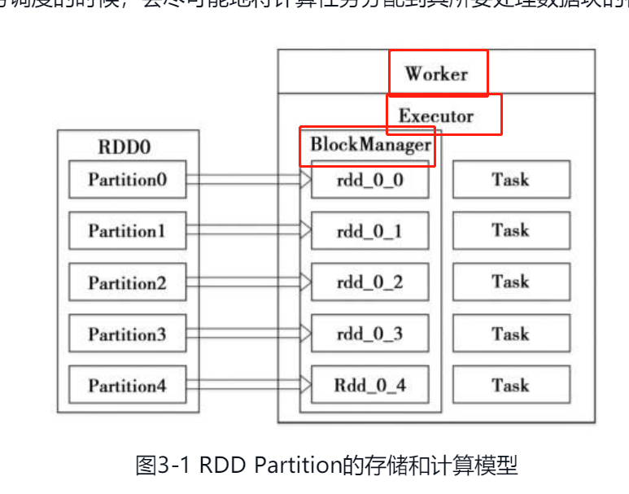
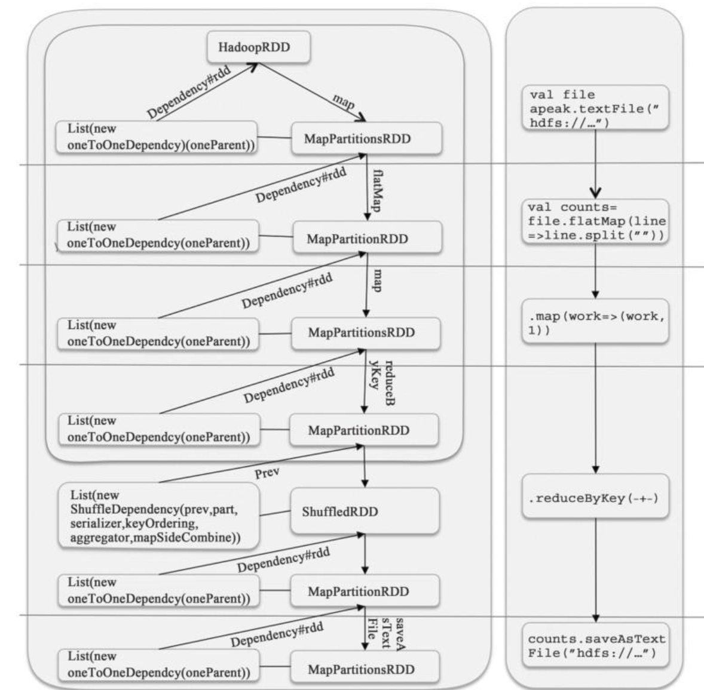
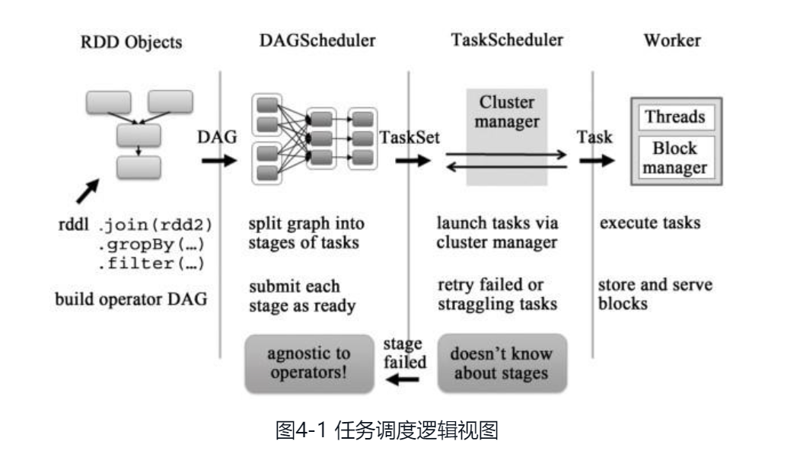
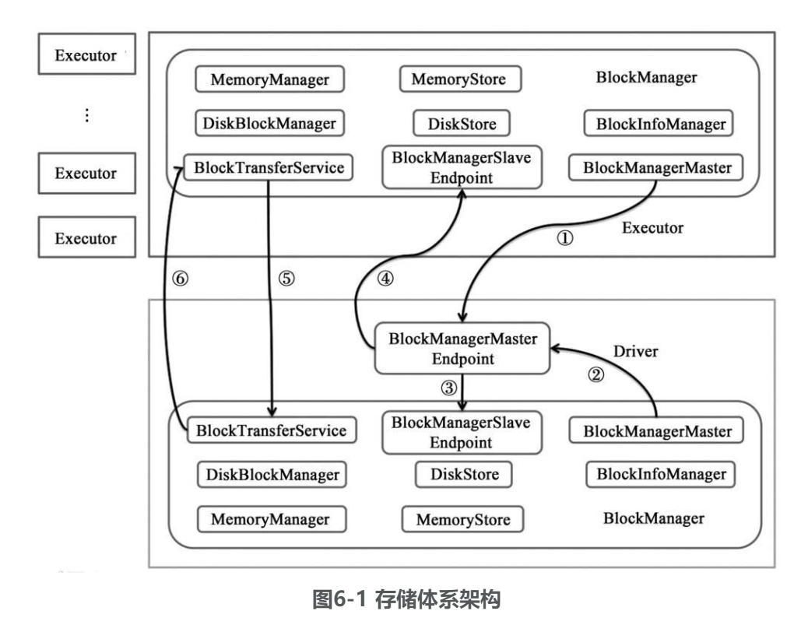
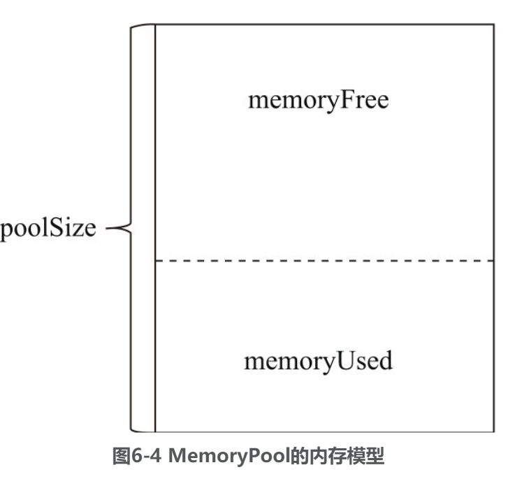
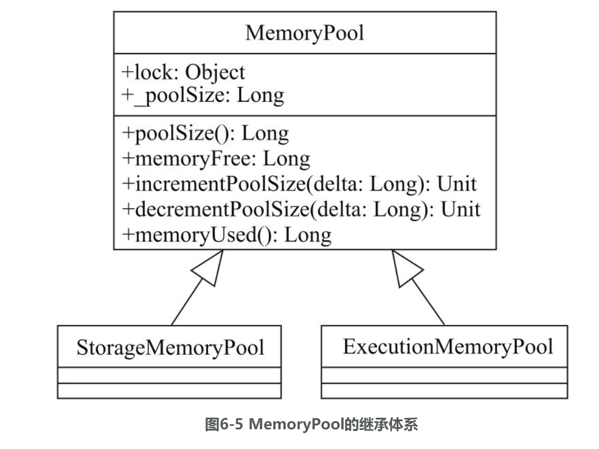

# 架构、组件

# rdd

RDD只能基于在稳定物理存储中的数据集和其他已有的RDD上执行确定性操作来创建。这些确定性操作称为转换，如map、filter、groupBy、join。RDD不需要物化。RDD含有如何从其他RDD衍生（即计算）出本RDD的相关信息（即Lineage），因此在RDD部分分区数据丢失的时候可以从物理存储的数据计算出相应的RDD分区。

同时具有数据流模型的特点：自动容错、位置感知性调度和可伸缩性。RDD允许用户在执行多个查询时显式地将工作集缓存在内存中，后续的查询能够重用工作集，这极大地提升了查询速度。

每个RDD有5个主要的属性：

1）一组分片（Partition），即数据集的基本组成单位。对于RDD来说，每个分片都会被一个计算任务处理，并决定并行计算的粒度。用户可以在创建RDD时指定RDD的分片个数，如果没有指定，那么就会采用默认值。默认值就是程序所分配到的CPU Core的数目。图3-1描述了分区存储的计算模型，每个分配的存储是由BlockManager实现的。每个分区都会被逻辑映射成BlockManager的一个Block，而这个Block会被一个Task负责计算。

2）一个计算每个分区的函数。Spark中RDD的计算是以分片为单位的，每个RDD都会实现compute函数以达到这个目的。compute函数会对迭代器进行复合，不需要保存每次计算的结果。

3）RDD之间的依赖关系。RDD的每次转换都会生成一个新的RDD，所以RDD之间就会形成类似于流水线一样的前后依赖关系。在部分分区数据丢失时，Spark可以通过这个依赖关系重新计算丢失的分区数据，而不是对RDD的所有分区进行重新计算。

4）一个Partitioner，即RDD的分片函数。当前Spark中实现了两种类型的分片函数，一个是基于哈希的HashPartitioner，另外一个是基于范围的RangePartitioner。只有对于key-value的RDD，才会有Partitioner，非key-value的RDD的Parititioner的值是None。Partitioner函数不但决定了RDD本身的分片数量，也决定了parent RDD Shuffle输出时的分片数量。

5）一个列表，存储存取每个Partition的优先位置（preferred location）。

只有当发生一个要求返回结果给Driver的动作时，这些转换才会真正运行。

RDD相关的持久化和缓存，是Spark最重要的特征之一。可以说，缓存是Spark构建迭代式算法和快速交互式查询的关键。

如果计算特别复杂或者计算耗时特别多，那么缓存丢失对于整个Job的影响是不容忽视的。为了避免缓存丢失重新计算带来的开销，Spark又引入了检查点（checkpoint）机制。

而检查点不同，它是在计算完成后，重新建立一个Job来计算。为了避免重复计算，推荐先将RDD缓存，这样就能保证检查点的操作可以快速完成。

1）窄依赖指的是每一个parent RDD的Partition最多被子RDD的一个Partition使用

2）宽依赖指的是多个子RDD的Partition会依赖同一个parent RDD的Partition

对于join，如果每个Partition仅仅和已知的、特定的Partition进行join，那么这个依赖关系也是窄依赖。

现在有两种窄依赖的具体实现，一种是一对一的依赖，即OneToOneDependency

UnionRDD是把多个RDD合成一个RDD，这些RDD是被拼接而成，即每个parent RDD的Partition的相对顺序不会变，只不过每个parent RDD在UnionRDD中的Partition的起始位置不同。

宽依赖的实现只有一种：ShuffleDependency。子RDD依赖于parent RDD的所有Partition，因此需要Shuffle过程：

宽依赖支持两种Shuffle Manager，即org.apache.spark.shuffle.hash.HashShuffleManager（基于Hash的Shuffle机制）和org.apache.spark.shuffle.sort.SortShuffleManager（基于排序的Shuffle机制）。

rdd转换

# dag生成

RDD之间的依赖关系，包含了RDD由哪些ParentRDD(s)转换而来和它依赖parent RDD(s)的哪些Partitions，是DAG的重要属性。借助这些依赖关系，DAG可以认为这些RDD之间形成了Lineage （血统）。

深度优先遍历？

根据依赖关系的不同将DAG划分为不同的阶段（Stage）。对于窄依赖，由于Partition依赖关系的确定性， Partition的转换处理就可以在同一个线程里完成，窄依赖被Spark划分到同一个执行阶段；对于宽依赖，由于Shuffle的存在，只能在parentRDD(s)Shuffle处理完成后，才能开始接下来的计算，因此宽依赖就是Spark划分Stage的依据，即Spark根据宽依赖将DAG划分为不同的Stage。在一个Stage内部，每个Partition都会被分配一个计算任务（Task），这些Task是可以并行执行的。Stage之间根据依赖关系变成了一个大粒度的DAG，这个DAG的执行顺序也是从前向后的。也就是说，Stage只有在它没有parent Stage或者parentStage都已经执行完成后，才可以执行。

# task生成

原始的RDD经过一系列转换后，会在最后一个RDD上触发一个动作，这个动作会生成一个Job。在Job被划分为一批计算任务（Task）后，这批Task会被提交到集群上的计算节点去计算。计算节点执行计算逻辑的部分称为Executor。Executor在准备好Task的运行时环境后，会通过调用org.apache.spark.scheduler.Task#run来执行计算。Spark的Task分为两种：

1）org.apache.spark.scheduler.ShuffleMapTask

2）org.apache.spark.scheduler.ResultTask

简单来说，DAG的最后一个阶段会为每个结果的Partition生成一个ResultTask，其余所有的阶段都会生成ShuffleMapTask。生成的Task会被发送到已经启动的Executor上，由Executor来完成计算任务的执行，执行过程的实现在org.apache. spark.executor.Executor.TaskRunner#run。

cache-Manager是org.apache.spark.CacheManager，它负责调用BlockManager来管理RDD的缓存，如果当前RDD原来计算过并且把结果缓存起来，那么接下来的运算都可以通过BlockManager来直接读取缓存后返回。

RDD的每个Partition对应Storage模块的一个Block，只不过Block是Partition经过处理后的数据。在系统实现的层面上，可以认为Partition和Block是一一对应的。cacheManager会通过getOrCompute来判断当前的RDD是否需要进行计算。首先，cacheManager会通过RDD的ID和当前计算的Partition的ID向Storage模块的BlockManager发起查询请求，如果能够获得Block的信息，会直接返回Block的信息。否则，代表该RDD是需要计算的。这个RDD以前可能计算过并且被存储到了内存中，但是后来由于内存紧张，这部分内存被清理了。在计算结束后，计算结果会根据用户定义的存储级别，写入BlockManager中。这样，下次就可以不经过计算而直接读取该RDD的计算结果了。

在缓存没有命中的情况下，首先会判断是否保存了RDD的checkpoint，如果有，则读取checkpoint。

# checkpoint

doCheckpoint首先为数据创建一个目录；然后启动一个新的Job来计算，并且将计算结果写入新创建的目录；接着创建一个org.apache.spark.rdd.CheckpointRDD；最后，原始RDD的所有依赖被清除，这就意味着RDD的转换的计算链（compute chain）等信息都被清除。这个处理逻辑中，数据写入的实现在org.apache.spark.rdd.CheckpointRDD$#writeToFile。

# sparkEnv

# 任务调度

任务调度模块主要包含两大部分，即DAGScheduler和TaskScheduler，它们负责将用户提交的计算任务按照DAG划分为不同的阶段并且将不同阶段的计算任务提交到集群进行最终的计算。

DAGScheduler主要负责分析用户提交的应用，并根据计算任务的依赖关系建立DAG，然后将DAG划分为不同的Stage（阶段），其中每个Stage由可以并发执行的一组Task构成，这些Task的执行逻辑完全相同，只是作用于不同的数据。

TaskScheduler通过Cluster Manager在 集 群 中 的 某 个Worker的Executor上 启 动任务。在Executor中运行的任务，如果缓存中没有计算结果，那么就需要开始计算，同时，计算的结果会回传到Driver或者保存在本地。在不同的资源管理框架下， TaskScheduler的实现方式是有差别的，但是最重要的实现是org.apache.spark.scheduler. TaskSchedulerImpl。

# 存储体系

BlockTransferService：块传输服务。此组件也与Shuffle相关联，主要用于不同阶段的任务之间的Block数据的传输与读写。例如，map任务所在节点的BlockTransferService给Shuffle对应的reduce任务提供下载map中间输出结果的服务。

MapOutputTracker:map任务输出跟踪器。

BlockInfoManager：块信息管理器。负责对Block的元数据及锁资源进行管理。

DiskBlockManager：磁盘块管理器。对磁盘上的文件及目录的读写操作进行管理。

MemoryStore：内存存储。依赖于MemoryManager，负责对Block的内存存储。

在Spark的存储体系中，数据的读写也是以块为单位，只不过这个块并非操作系统的块，而是设计用于Spark存储体系的块。每个Block都有唯一的标识，Spark把这个标识抽象为BlockId

BlockInfo用于描述块的元数据信息，包括存储级别、Block类型、大小、锁信息等

BlockResult用于封装从本地的BlockManager中获取的Block数据及与Block相关联的度量数据。

Spark除将内存作为计算资源外，还将内存的一部分纳入到存储体系中。Spark使用MemoryManager对存储体系和内存计算所使用的内存进行管理

UnifiedMemoryManager在MemoryManager的内存模型之上，将计算内存和存储内存之间的边界修改为“软”边界，即任何一方可以向另一方借用空闲的内存。

MemoryStore负责将Block存储到内存。Spark通过将广播数据、RDD、Shuffle数据存储到内存，减少了对磁盘I/O的依赖，提高了程序的读写效率

# shuffle