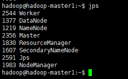

# 规划

三节点


# vagrant 安装

## 版本

- vagrant:https://www.vagrantup.com/
- virtualbox:https://www.virtualbox.org/

## 插件

### vagrant-hostmanager

Vagrantfile里配置

~~~
  config.hostmanager.enabled = true
  config.hostmanager.manage_host = true
  config.hostmanager.manage_guest = true
~~~

在定义虚拟机的时候，可以添加 hostname 来设置虚拟机的主机名：

~~~
  config.vm.define "node1" do |node1|
    node1.vm.network "private_network", ip: "192.168.10.11"
    node1.vm.hostname="node1"
  end
~~~

启动虚拟机以后会自动更新虚拟机的主机名，同时也会更新本地主机上的 hosts 文件里的内容。

或者我们也可以手工的去更新，执行命令：

~~~
vagrant hostmanager
~~~

# 集群配置

vagrant init后修改VagrantFile

~~~
# 2代表有两个defile
Vagrant.configure("2") do |config|
    (1..2).each do |i|
      config.vm.define "slave#{i}" do |node|
          node.vm.box = "ubuntu/xenial64"
          node.vm.hostname = "hadoop-slave#{i}"
          node.vm.network :private_network, ip: "192.168.10.1#{i}"
          node.vm.network "forwarded_port", guest: 22, host: "222#{i}", id: "ssh", disabled: "true"
          node.vm.network "forwarded_port", guest: 22, host: "222#{i+1}"
          node.vm.provider "virtualbox" do |vb|
          vb.memory = "512"
          # node.vm.provision "shell", path: "slaver_init.sh", privileged: false
        end
      end
    end
    
    config.vm.define :master1, primary: true do |master|
      master.vm.provider "virtualbox" do |v|
        v.customize ["modifyvm", :id, "--name", "hadoop-master1", "--memory", "1024"]
      end
      master.vm.box = "ubuntu/xenial64"
      master.vm.hostname = "hadoop-master1"
      # 注意：在解决多个SSH端口时，需要先禁用默认的ssh转发，再添加自定义转发，才能生效
      master.vm.network :private_network, ip: "192.168.10.10"
      master.vm.network "forwarded_port", guest: 22, host: 2219, id: "ssh", disabled: "true"
      master.vm.network "forwarded_port", guest: 22, host: 2220
      # 初始化脚本， reload会重新执行哟！！！
      master.vm.provision "shell", path: "master_init.sh", privileged: false
    end
  #manage hosts file 
  config.hostmanager.enabled = true
  config.hostmanager.manage_host = true
  config.hostmanager.manage_guest = true

end

~~~

### vagrant支持以下三种网络配置：

#### Forwarded port(端口映射)

是指将宿主计算机的端口映射到虚拟机上的某个端口上，访问宿主计算机的该端口时，请求实际会被转发到虚拟机上指定的端口，配置文件设置语法为：

```javascript
config.vm.network :forwarded_port, guest: 80, host: 8889
```

优点：简单、容易理解、容易实现外网访问虚拟机。

缺点：需映射很多端口时较麻烦、不支持在宿主机器上使用小于1024的端口来转发(如:不能使用SSL的443端口来进行https连接)。

**官网配置文档地址：**https://www.vagrantup.com/docs/networking/forwarded_ports.html

#### Private network(私有网络)

这种网络配置下，只有主机可以访问虚拟机，如果多个虚拟机设置定在同一个网段也可以相互访问，当然虚拟机也是可以访问外部网络的。配置语法如下：

```javascript
config.vm.network "private_network", ip: "192.168.50.4" # 固定IP
```

还可以设置动态IP，配置语法如下：

```javascript
config.vm.network "private_network", type: "dhcp"
```

优点：安全，只能自己访问。

缺点：因私有原有，所以其他团队成员不能和你协作。

**官网配置文档地址：**https://www.vagrantup.com/docs/networking/private_network.html

#### Public network(公有网络)

这种配置下，虚拟机享受实体机一样的待遇，一样的网络配置，vagrant 1.3版本以后这种配置也支持设定固定IP,配置语法如下：

```javascript
config.vm.network "public_network", ip: "192.168.50.4"
```

还可以设置桥接网卡，配置语法如下：

```javascript
config.vm.network "public_network", bridge: "en1: Wi-Fi (AirPort)"
```

优点：方便团队协作，别人可以访问你的虚拟机。

缺点：需要有网络，有路由器分配IP

**官网配置文档地址：**https://www.vagrantup.com/docs/networking/public_network.html

### 共享目录

 　　有时候，我们希望虚拟机能和我们的主机共享一些文件夹，这时候在vagrant的配置文件中进行配置来达到共享目录的目的。

 vagrant的共享目录类型有：

- NFS (适用于Mac OS宿主机), 配置语法：

  ```javascript
  config.vm.synced_folder "/hostPath", "/guestPath", type: "nfs"
  ```

  **官网配置文档地址：**https://www.vagrantup.com/docs/synced-folders/nfs.html

- RSync , 配置语法：

  ```javascript
  config.vm.synced_folder "/hostPath", "/guestPath", type: "rsync"
  ```

  **官网配置文档地址：**https://www.vagrantup.com/docs/synced-folders/rsync.html

- SMB (适用于Windows宿主机), 配置语法：

  ```javascript
  config.vm.synced_folder "/hostPath", "/guestPath", type: "smb"
  ```

  **官网配置文档地址：**https://www.vagrantup.com/docs/synced-folders/smb.html

- VirtualBox

  如果你的vagrant使用virtualbox的provider,这是默认的共享目录的类型。这些同步文件夹使用ValualBox共享文件夹系统将文件更改从客户机同步到主机，反之亦然。

  **官网配置文档地址：**https://www.vagrantup.com/docs/synced-folders/virtualbox.html

### master_init.sh

~~~
# 允许密码登录（生产环境不允许）
sudo sed -i "s/PasswordAuthentication no/PasswordAuthentication yes/" /etc/ssh/sshd_config
# 添加hadoop用户（最好创建组和用户）
sudo useradd -m hadoop -s /bin/bash
echo "hadoop" | passwd  --stdin hadoop
sudo adduser hadoop sudo
echo "hadoop ALL=(ALL) NOPASSWD:ALL" >> /etc/sudoers
# 安装java
sudo apt update         # 更新apt
sudo apt install openssh-server		# 安装SSH
sudo apt install openjdk-8-jdk     # 安装JAVA
# 切换用户
su - hadoop
echo "JAVA_HOME=/usr/lib/jvm/java-8-openjdk-amd64" >> ~/.bashrc
# 创建公私钥对
mkdir .ssh
cd /home/hadoop.ssh
echo "\n\n" | ssh-keygen -t rsa 
cat id_rsa.pub >> authorized_keys
# 将公钥拷贝到服务器上
# 好在SSH还提供了公钥登录，可以省去输入密码的步骤
# rsa 私钥解密，公钥加密
echo hadoop | scp /home/hadoop/.ssh/authorized_keys hadoop@hadoop-slave1:/home/hadoop/.ssh/
echo hadoop | scp /home/hadoop/.ssh/authorized_keys hadoop@hadoop-slave1:/home/hadoop/.ssh/
# 安装hadoop
curl -o hadoop-3.2.2.tar.gz https://ftp.jaist.ac.jp/pub/apache/hadoop/common/hadoop-3.2.2/hadoop-3.2.2.tar.gz
sudo tar -zxf ~/hadoop-3.2.2.tar.gz -C /usr/local
cd /usr/local/
# 将文件夹名改为hadoop
sudo mv ./hadoop-3.2.2/ ./hadoop
sudo chown -R hadoop ./hadoop
# 添加环境变量
echo "export HADOOP_HOME=/usr/local/hadoop" >> ~/.bashrc
echo "export PATH=$PATH:$HADOOP_HOME/bin:$HADOOP_HOME/sbin" >> ~/.bashrc
source ~/.bashrc

############ 修改hadoop配置 #########################################
cd /usr/local/hadoop/
# 修改hadoop环境变量
echo "JAVA_HOME=/usr/lib/jvm/java-8-openjdk-amd64" >> ./etc/hadoop/hadoop-env.sh
# 添加workers
echo "hadoop-master1" > ./etc/hadoop/workers
echo "hadoop-slave1" >> ./etc/hadoop/workers
echo "hadoop-slave2" >> ./etc/hadoop/workers

cat > ./etc/hadoop/core-site.xml <<EOF
<?xml version="1.0" encoding="UTF-8"?>
<?xml-stylesheet type="text/xsl" href="configuration.xsl"?>
<configuration>
	<property>
		<name>hadoop.tmp.dir</name>
		<value>/usr/local/hadoop/tmp</value>
		<description>Abase for other temporary directories.</description>
	</property>
	<property>
	<!--指定namenode的地址-->
		<name>fs.defaultFS</name>
		<value>hdfs://hadoop-master1:9000</value>
	</property>
</configuration>
EOF

cat > ./etc/hadoop/hdfs-site.xml <<EOF
<?xml version="1.0" encoding="UTF-8"?>
<?xml-stylesheet type="text/xsl" href="configuration.xsl"?>
<configuration>
	<property>
		<name>dfs.replication</name>
		<value>3</value>
	</property>
</configuration>
EOF

cat > ./etc/hadoop/mapred-site.xml <<EOF
<?xml version="1.0" encoding="UTF-8"?>
<?xml-stylesheet type="text/xsl" href="configuration.xsl"?>
<configuration>
	<property>
		<name>mapreduce.framework.name</name>
		<value>yarn</value>
	</property>
</configuration>
EOF

cat > ./etc/hadoop/yarn-site.xml <<EOF
<?xml version="1.0" encoding="UTF-8"?>
<?xml-stylesheet type="text/xsl" href="configuration.xsl"?>
<configuration>
	<!-- Site specific YARN configuration properties -->
	<property>
		<name>yarn.nodemanager.aux-services</name>
		<value>mapreduce_shuffle</value>
	</property>
	<property>
		<name>yarn.resourcemanager.hostname</name>
		<value>hadoop-master1</value>
	</property>
</configuration>
EOF

# 清理环境并分发到节点上
cd /usr/local/
# 删除临时文件
rm -rf /usr/local/hadoop/tmp   
# 删除日志文件
rm -rf /usr/local/hadoop/logs/*   
# 打包hadoop
tar -zcf ~/hadoop.master.tar.gz ./hadoop			
cd ~
scp ./hadoop.master.tar.gz hadoop-slave1:/home/hadoop
scp ./hadoop.master.tar.gz hadoop-slave2:/home/hadoop
####### 配置spark ###########
curl -o spark-3.1.2.tgz https://ftp.jaist.ac.jp/pub/apache/spark/spark-3.1.2/spark-3.1.2-bin-hadoop3.2.tgz
cd /usr/local/
sudo mv ./spark-3.1.2-bin-hadoop3.2/ ./spark
sudo chown -R hadoop ./spark
echo "export SPARK_HOME=/usr/local/spark" >> ~/.bashrc
echo "export PATH=$PATH:$SPARK_HOME/bin:$SPARK_HOME/sbin" >> ~/.bashrc
source ~/.bashrc
#修改配置
cd /usr/local/spark/
cp ./conf/workers.template  ./conf/workers
echo "hadoop-master1" > ./conf/workers
echo "hadoop-slave1" >> ./conf/workers
echo "hadoop-slave2" >> ./conf/workers
cp ./conf/spark-env.sh.template ./conf/spark-env.sh
echo "export SPARK_DIST_CLASSPATH=$(/usr/local/hadoop/bin/hadoop classpath)" >> ./conf/spark-env.sh
echo "export HADOOP_CONF_DIR=/usr/local/hadoop/etc/hadoop" >> ./conf/spark-env.sh
echo "export SPARK_MASTER_IP=hadoop-master1" >> ./conf/spark-env.sh
# 打包分发
cd /usr/local/
tar -zcf ~/spark.master.tar.gz ./spark     # 打包spark
cd ~
scp ./spark.master.tar.gz hadoop-slave1:/home/hadoop
scp ./spark.master.tar.gz hadoop-slave2:/home/hadoop

sudo sed -i "s/127.0.2.1 hadoop-master1 hadoop-master1/#127.0.2.1 hadoop-master1 hadoop-master1/" /etc/hosts

~~~


### 操作

~~~
vagrant up
~~~


### 修改从节点

~~~
#hadoop配置
sudo rm -rf /usr/local/hadoop/
sudo tar -zxf ~/hadoop.master.tar.gz -C /usr/local
sudo chown -R hadoop /usr/local/hadoop
#spark配置
sudo rm -rf /usr/local/spark/
sudo tar -zxf ~/spark.master.tar.gz -C /usr/local
sudo chown -R hadoop /usr/local/spark

# 2节点
sudo sed -i "s/127.0.2.1 hadoop-slave2 hadoop-slave2/#127.0.2.1 hadoop-slave2 hadoop-slave2/" /etc/hosts
# 1节点
sudo sed -i "s/127.0.2.1 hadoop-slave1 hadoop-slave1/#127.0.2.1 hadoop-slave1 hadoop-slave1/" /etc/hosts
~~~


### 启动集群

~~~
#主
#hadoop
/usr/local/hadoop/bin/hdfs namenode -format
/usr/local/hadoop/sbin/start-all.sh
#spark
/usr/local/spark/sbin/start-master.sh

#从
/usr/local/spark/sbin/start-slaves.sh
~~~

## 终止集群

~~~
/usr/local/hadoop/sbin/stop--all.sh
/usr/local/spark/sbin/stop-master.sh
~~~

# 效果

## 主



## 从


# 附录

## Hadoop3.0开始默认端口的更改

**Namenode 端口:**
https服务的端口`50470 --> 9871`
NameNode web管理端口`50070 --> 9870`配置文件hdfs-site.xml
namenode RPC交互端口,用于获取文件系统metadata信息。`8020 --> 9820`配置文件core-site.xml
**Secondary NN 端口:**
暂未了解到`50091 --> 9869`
secondary NameNode web管理端口`50090 --> 9868`
**Datanode 端口:**
datanode的IPC服务器地址和端口`50020 --> 9867`配置文件hdfs-site.xml
datanode控制端口,用于**数据传输**`50010 --> 9866`配置文件hdfs-site.xml
https服务的端口`50475 --> 9865`
datanode的HTTP服务器和端口`50075 --> 9864`配置文件hdfs-site.xml

## Hadoop其他需要放行的端口

job tracker交互端口`8021`