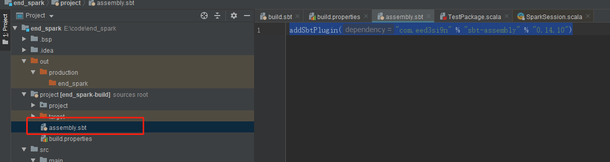
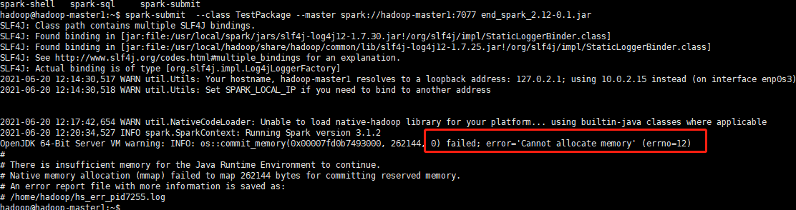
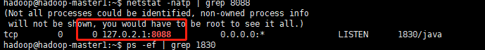
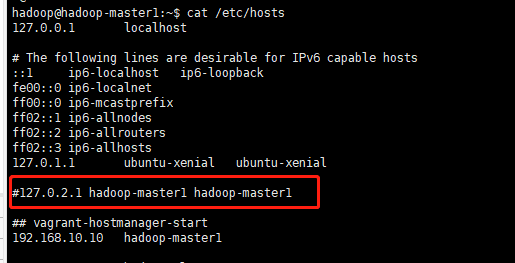
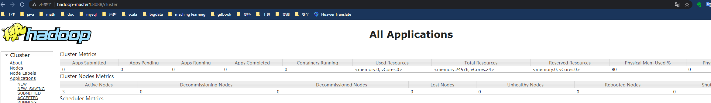
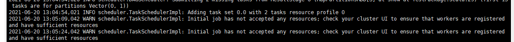
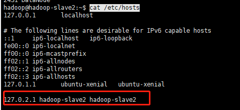
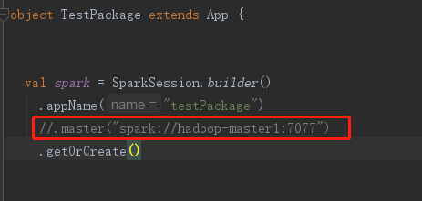
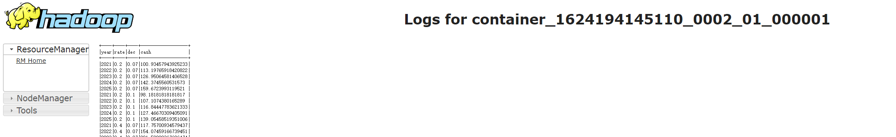
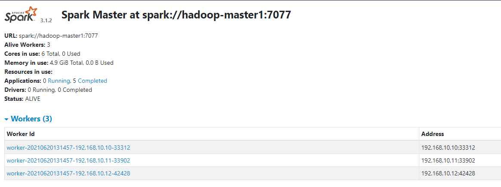

# sbt源配置

碰到insecure http问题，解决

repositories

```
[repositories]
# allowInsecureProtocol
aliyun-maven-repo: https://maven.aliyun.com/repository/public, allowInsecureProtocol
aliyun-nexus: https://maven.aliyun.com/nexus/content/groups/public/
typesafe: https://repo.typesafe.com/typesafe/ivy-releases/, [organization]/[module]/(scala_[scalaVersion]/)(sbt_[sbtVersion]/)[revision]/[type]s/[artifact](-[classifier]).[ext], bootOnly
maven-central
sonatype-oss-releases
sonatype-oss-snapshots
ivy-sbt-plugin: https://dl.bintray.com/sbt/sbt-plugin-releases/, [organization]/[module]/(scala_[scalaVersion]/)(sbt_[sbtVersion]/)[revision]/[type]s/[artifact](-[classifier]).[ext]
```

注意spark与scala版本匹配问题

# 添加assembly

```
addSbtPlugin("com.eed3si9n" % "sbt-assembly" % "0.14.10")
```



# 打包

```
 sbt clean compile package assembly

```

# 提交任务

```
spark-submit  --class TestPackage --master yarn --deploy-mode cluster end_spark_2.12-0.1.jar
```

# 失败

## 内存不够



增加虚拟机内存


## 查看不了yarn web

```
配置 https://hadoop.apache.org/docs/r2.10.1/hadoop-yarn/hadoop-yarn-common/yarn-default.xml

```



/etc/hosts出问题了

注释掉



访问成功




## work加入不成功



worker的/etc/hosts没有修改，注释掉，重启



## master设置问题

使用yarn做为master后，注释此行



# 效果



