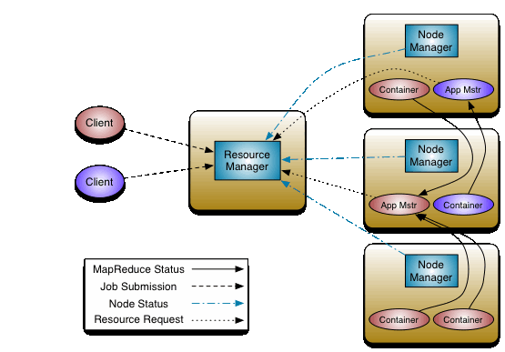

# yarn主要作用
资源管理，任务调度

- 将资源管理和作业控制分离，减小JobTracker压力
- YARN的设计大大减小了 JobTracker（也就是现在的 ResourceManager）的资源消耗，并且让监测每一个 Job 子任务 (tasks) 状态的程序分布式化了，更安全、更优美。
- 资源隔离。Yarn 使用了轻量级资源隔离机制 Cgroups 进行资源隔离以避免相互干扰，一旦 Container 使用的资源量超过事先定义的上限值，就将其杀死。
- 自动 failover 处理。例如 Yarn NodeManager 监控、Yarn ApplicationManager 异常恢复。

YARN是一个双层调度器（Two-level scheduler），解决了中央调度器（Monolithic scheduler）的不足（中央调度器典型的代表就是JobTracker)，双层调度架构看上去为调度增加了灵活性和并发性，但实际上它保守的资源可见性和上锁算法（使用悲观并发）也限制了灵活性和并发性。

第一，保守的资源可见性导致各框架无法感知整个集群的资源使用情况，有空闲资源无法通知排队的进程，容易造成资源的浪费；

第二，上锁算法降低了并发性，调度器会将资源分配给一个架构，只有该架构返回资源后，调度器才回将该部分资源分配给其他架构，在第一个分配过程中，资源相当于被锁住，从而降低了并发性。总结来说，YARN同其他双层架构的调度器（例如：Mesos）都有的不足为：

- 各个应用无法感知集群整体资源的使用情况，只能等待上层调度推送信息。
- 资源分配采用轮询、ResourceOffer机制（mesos)，在分配过程中使用悲观锁，并发粒度小。
- 缺乏一种有效的竞争或优先抢占的机制。

# yarn的结构

yarn总体上是master/slave结构，主要由ResourceManager、NodeManager、ApplicationMaster和Container等几个组件组成。

RM
RM负责处理客户端请求，对各NM上的资源进行统一管理和调度，给AplicationMaster分配空闲的Container运行并监控其运行状态，主要由调度器和应用程序管理器构成。
调度器仅根据各个应用程序的资源需求进行资源分配，而资源分配的单位是Container，调度器不负责监控或者跟踪应用程序的状态。
应用程序管理器主要负责整个系统中的所有的应用程序，包括应用程序的提交、与调度器协商资源以及启动AppMaster，监控AppMaster运行状态并在失败的时候重新启动等。

ResourceManager有两个主要的组件：Scheduler和ApplicationsManager。Scheduler只用于调度的场景。ApplicationsManager负责接收job的提交，分配初始的container来执行特定ApplicationMaster。

NodeManager
NM是每个节点上的资源和任务管理器。它会定时地向RM汇报本节点上的资源使用情况和各个Container的运行情况。同时接收并处理来自AppMaster的Container启动停止等请求。
AppMaster
用户提交的应用程序均包含一个AppMaster，负责应用的监控，跟踪应用执行状态、重启失败任务等。AppMaster是应用框架，它负责向RM协调资源，并且与NodeManager协同工作完成Task的执行和监控。
Container
Yarn中的资源抽象，它封装了某个节点上的多维度资源，如内存，CPU，磁盘，网络等。AppMaster向NodeManager申请资源的时候，资源是以container的形式表示的。

# yarn的工作流程

1. 用户向YARN 中提交应用程序
2. ResourceManager 为该应用程序分配第一个Container， 并与对应的NodeManager 通信，要求它在这个Container 中启动应用程序的ApplicationMaster。
3. ApplicationMaster 首先向ResourceManager 注册， 这样用户可以直接通过ResourceManage 查看应用程序的运行状态，然后它将为各个任务申请资源，并监控它的运行状态，直到运行结束，即重复步骤4~7。
4. ApplicationMaster 采用轮询的方式通过RPC 协议向ResourceManager 申请和领取资源。
5.  一旦ApplicationMaster 申请到资源后，便与对应的NodeManager 通信，要求它启动任务。
6. NodeManager 为任务设置好运行环境（包括环境变量、JAR 包、二进制程序等）后，将任务启动命令写到一个脚本中，并通过运行该脚本启动任务。
7. 各个任务通过某个RPC 协议向ApplicationMaster 汇报自己的状态和进度，以让ApplicationMaster 随时掌握各个任务的运行状态，从而可以在任务失败时重新启动任务。在应用程序运行过程中，用户可随时通过RPC 向ApplicationMaster 查询应用程序的当前运行状态。
8.  应用程序运行完成后，ApplicationMaster 向ResourceManager 注销并关闭自己。

# yarn的调度器
 FIFO Scheduler（队列调度器）
按任务提交的顺序排成一个队列，这是一个先进先出队列。在进行资源分配的时候，先给队列中最头上的任务分配资源，然后再分配给下一个。这是最简单也是最容易理解的调度器，但是它不适用与共享集群，大的任务会占用所有的集群资源，这就导致其它任务被阻塞。
Capacity Scheduler（容量调度器）
Capacity调度器允许多个组织共享整个集群，每个组织可以获得集群的一部分计算能力。通过为每个组织分配专门的队列，然后再为每个队列分配一定的集群资源，这样整个集群就可以通过设置多个队列的方式为多个组织提供服务了。除此之外，队列内部又可以垂直划分，这样一个组织内部的多个成员就可以共享这个队列资源，在一个队列的内部，资源的调度采用的是先进先出策略。

 Fair Scheduler(公平调度器)

# yarn高可用

### RM Failover

ResourceManager HA通过一个主从架构实现——在任意时刻，总有一个RM是active的，而一个或更多的RM处于standby状态等待随时成为active。触发active的转换的条件是通过admin命令行或者在automatic-failover启用的情况下通过集成的failover-controller触发。

#### 手动转换和failover

当自动failover没有启用时，管理员需要手动切换众多RM中的一个成为active。为了从一个RM到其他RM进行failover，做法通常是先将现在的Active的RM切为Standby，然后再选择一个Standby切为Active。所有这些都可以通过"yarn rmadmin"的命令行完成。

#### 自动failover

RM有一个选项可以嵌入使用Zookeeper的ActiveStandbyElector来决定哪个RM成为Active。当Active挂掉或者不响应时，另一个RM会自动被选举为Active然后接管集群。注意，并不需要像HDFS一样运行一个隔离的ZKFC守护进程，因为对于嵌入到RM中的ActiveStandbyElector表现出来就是在做failure检查和leader选举，不用单独的ZKFC。

#### 在RM failover时的Client, ApplicationMaster和 NodeManager

当有多个RM时，被client和node使用的配置文件yarn-site.xml需要列出所有的RM。Clients, ApplicationMasters (AMs) 和 NodeManagers (NMs) 会以一种round-robin轮询的方式来不断尝试连接RM直到其命中一个active的RM。如果当前Active挂掉了，他们会恢复round-robin来继续寻找新的Active。默认的重试策略是 org.apache.hadoop.yarn.client.ConfiguredRMFailoverProxyProvider类来实现的。你可以通过继承实现org.apache.hadoop.yarn.client.RMFailoverProxyProvider来覆盖这个方法，并且设置对应的类名到这个属性yarn.client.failover-proxy-provider。

### 从之前的主RM状态恢复

伴随ResourceManager的重启机制开启，升级为主的RM会加载RM内部状态并且恢复原来RM留下的状态，而这依赖于RM的重启特性。而之前提交到RM的作业会发起一个新的尝试请求。应用作业会周期性的checkpoint来避免任务丢失。状态存储对于所有的RM都必须可见。当前，有两种RMStateStore实现来支持持久化—— FileSystemRMStateStore 和 ZKRMStateStore。其中 ZKRMStateStore隐式的允许在任意时刻写到一个单一的RM，因此是HA集群的推荐存储。当使用ZKRMStateStore时，不需要单独的隔离机制来解决分布式的脑裂问题（多个RM都成为Active）。

https://www.zybuluo.com/changedi/note/675439

